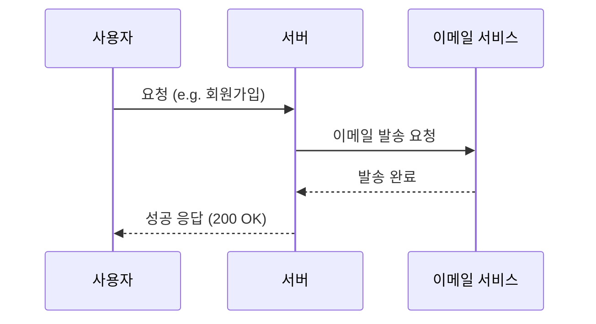
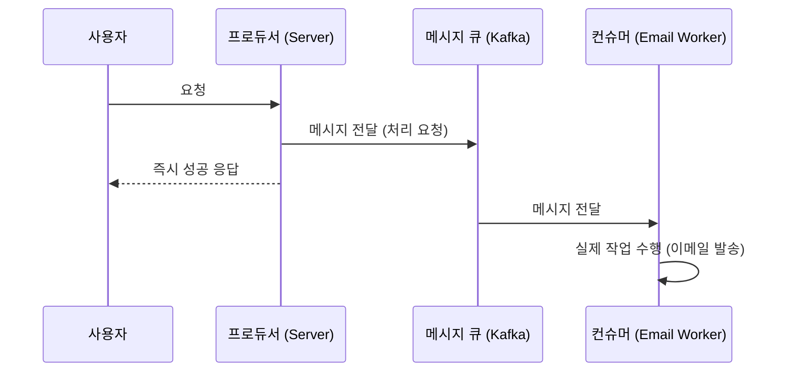

# 01. 카프카 기본 개념

## 카프카란 무엇인가?

Apache Kafka는 **고성능 분산 이벤트 스트리밍 플랫폼**이다.
입문자용으로 쉽게 설명하면, **Kafka는 대규모 데이터를 처리할 수 있는 메시지 큐**이다.

### 주요 특징
- **고가용성**: 데이터 리플리케이션을 통해 서버 장애 시에도 데이터 손실 없이 운영 가능
- **확장성**: 브로커를 추가하여 성능과 용량을 선형적으로 확장 가능
- **영속성**: 메시지를 디스크에 저장하여 일정 기간 동안 데이터를 보관 및 재처리 가능
- **고성능**: 대량의 데이터를 낮은 지연 시간으로 처리 가능

---

## 메시지 큐(Message Queue)란? 

**메시지 큐(Message Queue)**는 **큐(Queue) 형태에 데이터를 일시적으로 저장하는 임시 저장소**를 의미한다. 메시지 큐를 활용하면 **비동기**적으로 데이터를 처리할 수 있어서 효율적이다.

### 동기 vs 비동기
- **동기적 처리**: A 작업이 다 끝난 이후에 B 작업을 처리 (순차적)
- **비동기적 처리**: A 작업을 시작한 직후에 B 작업도 바로 시작 (병렬적, A가 끝날 때까지 기다리지 않음)

---

## REST API 방식 vs 메시지 큐 활용 방식 

### REST API 방식
요청을 보낸 뒤에 **모든 작업이 다 처리될 때까지 기다렸다가** 응답을 받는 식의 통신 방식이다.

### 메시지 큐 방식
모든 작업이 다 처리되는 것과 상관없이 응답을 받을 수 있는 비동기 방식이다.

**처리 과정:**
1. **사용자 요청**: REST API 방식으로 요청을 보낸다.
2. **메시지 생성 (Producer)**: 
    - 서버는 처리해야 할 정보를 담은 메시지를 만들어 메시지 큐에 전달한다.
    - '메시지를 생산하는 주체'를 의미한다.
3. **즉시 응답**: Producer 서버는 메시지 큐에 메시지를 넣자마자 사용자에게 성공 응답을 보낸다 (비동기 처리).
4. **메시지 보관**: 메시지 큐는 받은 메시지를 임시 보관한다.
5. **메시지 소비 (Consumer)**: 
    - Consumer 서버가 메시지 큐에서 메시지를 꺼내 실제 작업을 수행한다.
    - '메시지를 소비하는 주체'를 의미한다.

---

## 핵심 구성 요소: 프로듀서와 컨슈머 

카프카 통신의 핵심은 데이터를 보내는 쪽과 받는 쪽을 분리하는 것이다.

- **프로듀서(Producer)**: 메시지를 생성하여 카프카로 **보내는** 주체
- **컨슈머(Consumer)**: 카프카에 저장된 메시지를 **가져와서 처리하는** 주체

이 구조 덕분에 데이터를 보내는 서버와 받는 서버가 서로의 상태를 몰라도 안정적으로 데이터를 주고받을 수 있다.

> 더 자세한 내용은 [04. 프로듀서와 컨슈머](../04-producer-consumer/ProducerConsumer.md)에서 학습할 수 있다.

---

## 카프카의 탄생 배경과 특징 

### 탄생 배경
- **LinkedIn에서의 필요성**: 기존의 메시징 시스템으로는 LinkedIn 내의 급증하는 데이터 처리와 복잡한 데이터 흐름을 관리하기 어려웠다.
- **파편화된 데이터 파이프라인**: 수많은 소스 애플리케이션과 타겟 애플리케이션 간의 복잡한 연결(N:N 연결) 문제를 해결하기 위해 통합된 데이터 허브가 필요했다.
- **실시간 처리**: 데이터의 실시간 분석 및 처리에 대한 수요가 증가함에 따라 고안되었다.

### 메시지 큐(Message Queue, MQ)와 카프카의 차이
- **일반적인 MQ (RabbitMQ, ActiveMQ 등)**:
    - 메시지를 읽으면 보통 큐에서 삭제된다.
    - 소규모 데이터 및 복잡한 라우팅에 적합하다.
- **Kafka**:
    - 메시지를 파일 시스템에 저장하여 읽어도 삭제되지 않는다 (설정된 보관 주기 동안).
    - 여러 컨슈머가 동일한 데이터를 반복해서 읽을 수 있다.
    - 대규모 이벤트 스트리밍 및 로그 처리에 특화되어 있다.
