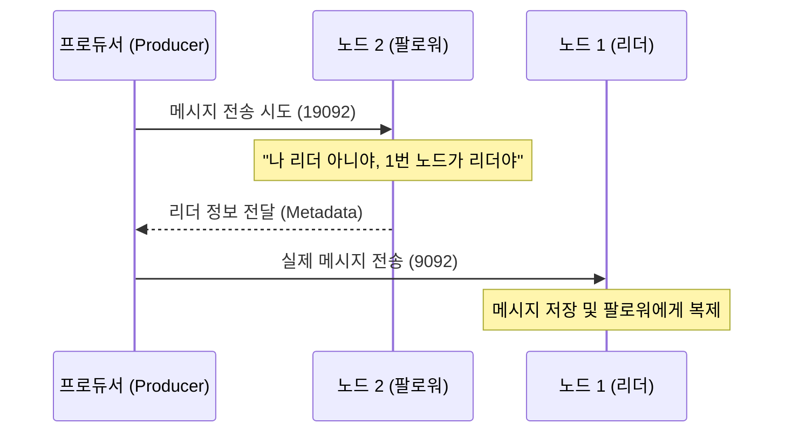

# [실습] 팔로워 파티션에 메시지를 넣으면 어떻게 될까?

리더 파티션과 팔로워 파티션의 역할을 이해하고, 팔로워 파티션이 있는 노드로 메시지를 보냈을 때 카프카가 어떻게 동작하는지 실습을 통해 확인한다.

---

## ✅ 개요

이전 아키텍처 강의에서 다음과 같이 학습했다.
> **리더 파티션**은 프로듀서나 컨슈머가 직접적으로 메시지를 쓰고 읽는 파티션이다. 반면에 **팔로워 파티션**은 프로듀서나 컨슈머가 직접적으로 메시지를 쓰고 읽지 않는다.

그렇다면, 실제로 팔로워 파티션을 가지고 있는 노드에 메시지를 전송하면 에러가 날까? 아니면 정상적으로 처리될까? 실습을 통해 알아보자.

---

## ✅ 실습 과정

### 1. 리더 파티션 위치 확인
먼저 `email.send` 토픽의 리더 파티션이 어느 노드에 있는지 확인한다.

```bash
$ bin/kafka-topics.sh \
    --bootstrap-server localhost:9092 \
    --describe \
    --topic email.send
```

**[실행 결과 예시]**
```text
Topic: email.send  Partition: 0  Leader: 1  Replicas: 1, 2, 3  Isr: 1, 2, 3
```
* 위 예시에서는 **노드 1(9092)**이 리더다. 따라서 **노드 2(19092)**와 **노드 3(29092)**은 팔로워 파티션을 가지고 있다.

### 2. 팔로워 파티션 노드에 메시지 전송
리더가 아닌 **노드 2(19092)**를 대상으로 프로듀서를 실행하여 메시지를 보내본다.

```bash
$ bin/kafka-console-producer.sh \
    --bootstrap-server localhost:19092 \
    --topic email.send

# 메시지 입력
> follower-message-1
```

### 3. 모든 노드에서 메시지 조회
메시지가 정상적으로 모든 노드에 복제되었는지 확인하기 위해 각 노드의 포트로 컨슈머를 실행해본다.

```bash
# 노드 1 (9092) 확인
$ bin/kafka-console-consumer.sh --bootstrap-server localhost:9092 --topic email.send --from-beginning

# 노드 2 (19092) 확인
$ bin/kafka-console-consumer.sh --bootstrap-server localhost:19092 --topic email.send --from-beginning

# 노드 3 (29092) 확인
$ bin/kafka-console-consumer.sh --bootstrap-server localhost:29092 --topic email.send --from-beginning
```

---

## ✅ 결과 해석

실습 결과, 리더 파티션이 아닌 팔로워 파티션이 있는 노드(19092)에 메시지를 넣더라도 **에러 없이 잘 들어가는 것**을 확인할 수 있다. 또한 모든 노드에서 해당 메시지가 조회되므로 복제도 정상적으로 이루어졌다.

### 왜 가능한가요?
카프카 프로듀서는 메시지를 보내기 전에 **클러스터의 메타데이터**를 확인하여 해당 파티션의 리더가 누구인지 자동으로 파악한다.

1. 프로듀서가 아무 노드(예: 19092)에 접속하여 "이 토픽의 리더가 누구니?"라고 묻는다.
2. 카프카 노드들은 서로 연동되어 정보를 공유하고 있으므로, "리더는 1번 노드야"라고 답해준다.
3. 프로듀서는 이 정보를 바탕으로 **실제 메시지를 리더 파티션이 있는 노드(9092)로 재전송**한다.

즉, 우리가 19092 포트로 메시지를 보냈더라도 내부적으로는 리더 파티션인 9092로 전달되어 처리된 것이다. 이 과정은 카프카 클라이언트 라이브러리 내에서 **자동으로 처리**되므로 사용자는 리더의 위치를 매번 신경 쓰지 않아도 된다.

---

## 📊 동작 원리 시각화


