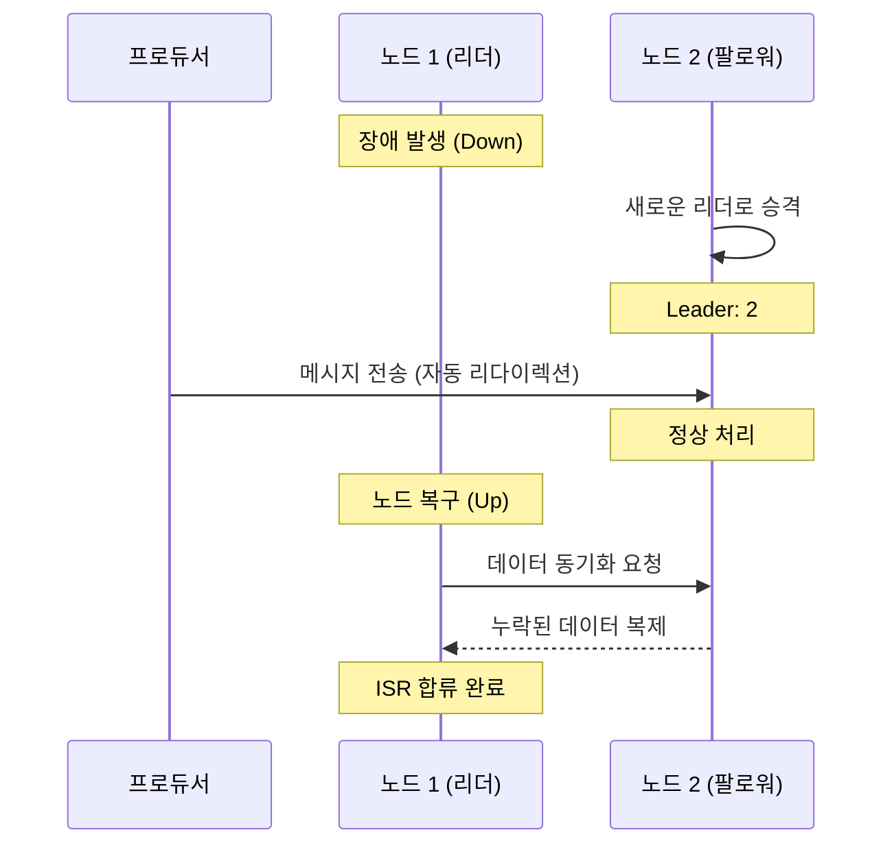

# [실습] 리더 파티션에 장애가 발생하면 어떻게 될까?

카프카의 핵심 기능 중 하나인 **고가용성(High Availability)**을 실제로 체험해본다. 리더 파티션이 있는 노드에 장애가 발생했을 때, 클러스터가 어떻게 자동으로 대처하고 서비스를 지속하는지 확인한다.

---

## ✅ 개요

이전 아키텍처 강의에서 다음과 같이 학습했다.
> 리더 파티션에 장애가 발생하면 팔로워 파티션이 리더 역할(프로듀서로부터 메시지를 받고, 컨슈머가 메시지를 처리)을 대신 수행한다.

실제로 노드 하나를 강제로 종료시켜서 이 과정이 어떻게 일어나는지, 그리고 서비스가 중단 없이 유지되는지 실습해본다.

---

## ✅ 실습 과정

### 1. 현재 리더 노드 확인
`email.send` 토픽의 리더가 누구인지 확인한다.

```bash
$ bin/kafka-topics.sh \
    --bootstrap-server localhost:9092 \
    --describe \
    --topic email.send
```

**[실행 결과 예시]**
```text
Topic: email.send  Partition: 0  Leader: 1  Replicas: 1, 2, 3  Isr: 1, 2, 3
```
* 위 예시에서는 **노드 1(9092)**이 리더다.

### 2. 리더 노드 강제 종료
리더 역할을 수행 중인 노드의 터미널로 가서 `Ctrl + C`를 눌러 프로세스를 종료한다. (노드 1 장애 발생 가정)

### 3. 리더 승격 및 상태 확인
노드 1이 종료되었으므로, 살아있는 다른 노드(예: 19092)를 통해 토픽 상태를 다시 조회한다.

```bash
$ bin/kafka-topics.sh \
    --bootstrap-server localhost:19092 \
    --describe \
    --topic email.send
```

**[실행 결과 예시]**
```text
Topic: email.send  Partition: 0  Leader: 2  Replicas: 1, 2, 3  Isr: 2, 3
```
* **Leader가 2로 변경**: 리더였던 1번 노드가 빠지고, 팔로워였던 2번 노드가 새로운 리더로 승격되었다.
* **Isr에서 1번 제외**: 장애가 발생한 1번 노드는 동기화 목록(ISR)에서 자동으로 제외되었다.

### 4. 장애 상태에서 서비스 테스트
서버 1대가 고장 났지만, 남은 서버들을 통해 정상적으로 메시지를 주고받을 수 있는지 확인한다.

```bash
# 새로운 리더(19092)를 통해 메시지 전송
$ bin/kafka-console-producer.sh \
    --bootstrap-server localhost:19092 \
    --topic email.send
> test-message-after-fail

# 메시지 조회
$ bin/kafka-console-consumer.sh \
    --bootstrap-server localhost:19092 \
    --topic email.send \
    --from-beginning
```
* 서버 1대가 다운되었음에도 불구하고 메시지 생산과 소비가 **중단 없이 가능함**을 확인할 수 있다.

### 5. 장애 노드 복구 및 동기화
종료했던 노드를 다시 실행하여 클러스터에 복귀시킨다.

```bash
# 노드 1 재시작
$ bin/kafka-server-start.sh config/server.properties
```

### 6. 복구 완료 확인
다시 토픽 정보를 조회하여 1번 노드가 ISR에 복귀했는지 확인한다.

```bash
$ bin/kafka-topics.sh \
    --bootstrap-server localhost:19092 \
    --describe \
    --topic email.send
```
**[실행 결과 예시]**
```text
Topic: email.send  Partition: 0  Leader: 2  Replicas: 1, 2, 3  Isr: 2, 3, 1
```
* `Isr` 목록에 다시 **1**이 포함되었다면, 장애 기간 동안 쌓였던 데이터를 모두 복제(동기화)하여 정상 상태로 돌아온 것이다.

---

## ✅ 결과 해석 및 정리

실습을 통해 카프카가 장애 상황에서도 어떻게 시스템을 유지하는지 확인했다.

1. **자동 리더 선출**: 리더 노드에 장애가 생기면 클러스터가 즉시 팔로워 중 하나를 새 리더로 승격시킨다.
2. **서비스 가용성 유지**: 프로듀서와 컨슈머는 클러스터의 변화를 자동으로 감지하여 새로운 리더와 통신하므로 서비스 장애를 예방할 수 있다.
3. **데이터 복구**: 장애 노드가 복구되면 자동으로 리더의 데이터를 따라잡아(Synchronization) 다시 고가용성 그룹(ISR)에 합류한다.

이것이 바로 카프카가 대규모 시스템에서 **신뢰할 수 있는 데이터 플랫폼**으로 선택받는 핵심 이유인 **고가용성(High Availability)**의 실체다.

---

## 📊 장애 조치(Failover) 시각화


