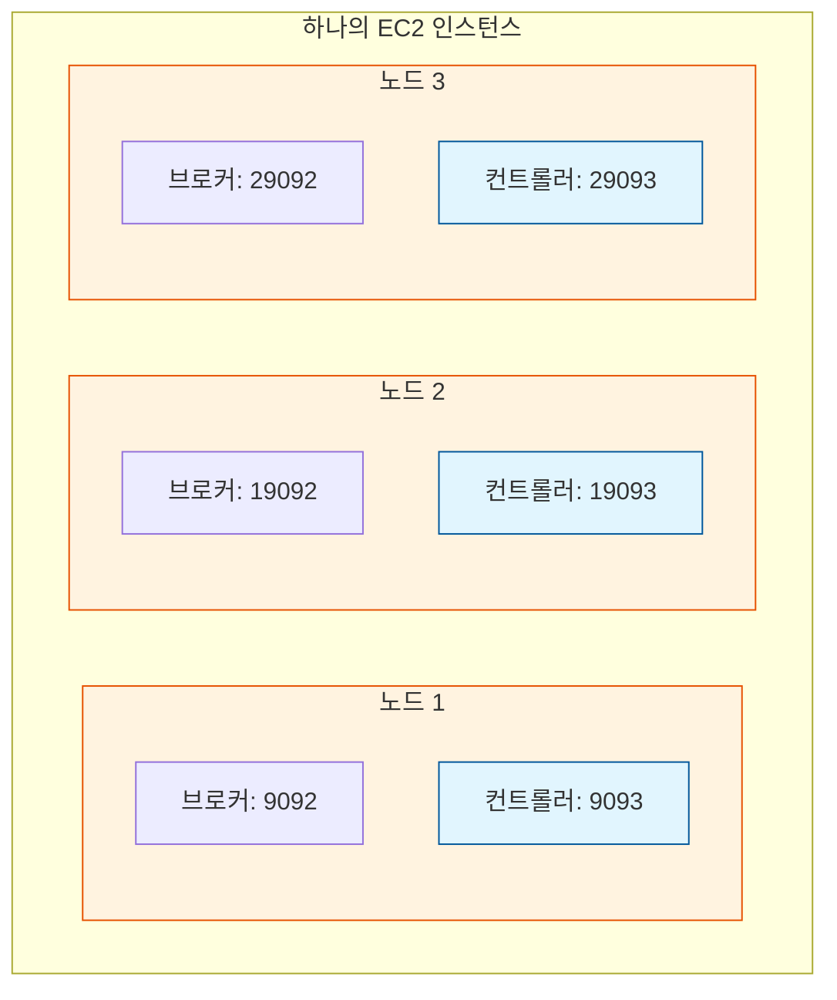

# [실습] 카프카 서버 총 3대 셋팅하기

고가용성을 확보하기 위해 하나의 EC2 인스턴스에 3개의 카프카 노드(노드 1, 2, 3)를 셋팅하는 실습을 진행한다.

## ✅ 카프카 서버 3대 셋팅하기

실무에서는 각각의 EC2 인스턴스에 카프카를 따로 설치하지만, 비용 절감을 위해 하나의 서버에서 포트를 다르게 하여 3개의 프로세스를 띄우는 방식으로 진행한다.

### 1. 카프카 설정 수정 및 복사

기본 설정 파일인 `server.properties`를 수정하고, 이를 복사하여 `server2.properties`, `server3.properties`를 만든다.

**[Node 1] `config/server.properties` 수정**
```properties
# 1. 노드 식별 ID
node.id=1

# 2. 클러스터 컨트롤러 주소 목록 (본인 EC2 Public IP 입력)
controller.quorum.bootstrap.servers={EC2-IP}:9093,{EC2-IP}:19093,{EC2-IP}:29093

# 3. 프로세스 실행 포트 지정
listeners=PLAINTEXT://:9092,CONTROLLER://:9093

# 4. 외부 접근 주소
advertised.listeners=PLAINTEXT://{EC2-IP}:9092,CONTROLLER://{EC2-IP}:9093

# 5. 데이터 저장 경로
log.dirs=/tmp/kafka-logs-1
```

**[복사 및 수정]**
```bash
$ cp config/server.properties config/server2.properties
$ cp config/server.properties config/server3.properties
```

**[Node 2] `config/server2.properties` 주요 수정 사항**
- `node.id=2`
- `listeners=PLAINTEXT://:19092,CONTROLLER://:19093`
- `advertised.listeners=PLAINTEXT://{EC2-IP}:19092,CONTROLLER://{EC2-IP}:19093`
- `log.dirs=/tmp/kafka-logs-2`

**[Node 3] `config/server3.properties` 주요 수정 사항**
- `node.id=3`
- `listeners=PLAINTEXT://:29092,CONTROLLER://:29093`
- `advertised.listeners=PLAINTEXT://{EC2-IP}:29092,CONTROLLER://{EC2-IP}:29093`
- `log.dirs=/tmp/kafka-logs-3`

---

### 2. 클러스터 초기화 및 노드 포맷

모든 노드는 하나의 **Cluster ID**를 공유해야 한다.

```bash
# 1. 기존 카프카 종료
$ bin/kafka-server-stop.sh

# 2. Cluster ID 및 Controller ID 생성
$ KAFKA_CLUSTER_ID="$(bin/kafka-storage.sh random-uuid)"
$ KAFKA_CONTROLLER_ID="$(bin/kafka-storage.sh random-uuid)"

# 3. 노드 1 포맷 (초기 컨트롤러 지정)
$ bin/kafka-storage.sh format \
    -t $KAFKA_CLUSTER_ID \
    -c config/server.properties \
    --initial-controllers "1@localhost:9093:$KAFKA_CONTROLLER_ID"

# 4. 노드 2, 3 포맷 (Cluster ID 연결)
$ bin/kafka-storage.sh format -t $KAFKA_CLUSTER_ID -c config/server2.properties --no-initial-controllers
$ bin/kafka-storage.sh format -t $KAFKA_CLUSTER_ID -c config/server3.properties --no-initial-controllers
```

---

### 3. 카프카 노드 실행 및 확인

각 노드를 별도의 터미널(또는 백그라운드)에서 실행한다.

```bash
# 노드 1 실행
$ bin/kafka-server-start.sh config/server.properties

# 노드 2 실행 (새 터미널)
$ bin/kafka-server-start.sh config/server2.properties

# 노드 3 실행 (새 터미널)
$ bin/kafka-server-start.sh config/server3.properties
```

**실행 확인 (포트 체크):**
```bash
$ lsof -i:9092,19092,29092   # 브로커 포트
$ lsof -i:9093,19093,29093   # 컨트롤러 포트
```

---

### 4. 컨트롤러 연동 및 상태 확인

노드 2와 3을 클러스터의 컨트롤러 그룹에 등록한다.

```bash
# 노드 2 컨트롤러 등록
$ bin/kafka-metadata-quorum.sh \
    --command-config config/server2.properties \
    --bootstrap-server localhost:9092 \
    add-controller

# 노드 3 컨트롤러 등록
$ bin/kafka-metadata-quorum.sh \
    --command-config config/server3.properties \
    --bootstrap-server localhost:9092 \
    add-controller
```

**최종 상태 확인:**
```bash
$ bin/kafka-metadata-quorum.sh --bootstrap-server localhost:9092 describe --status
```
`CurrentVoters` 항목에 3개의 컨트롤러 정보가 표시되면 성공이다.

---

## ➡️ 다음 단계

설치가 완료되었다면, 실제로 3대의 서버가 유기적으로 연동되어 데이터를 복제하고 있는지 확인해야 한다.

- [[실습] 카프카 서버 3대 연동 확인하기](./Multi-Broker-Verification.md)

---

### 📊 멀티 노드 클러스터 구조


