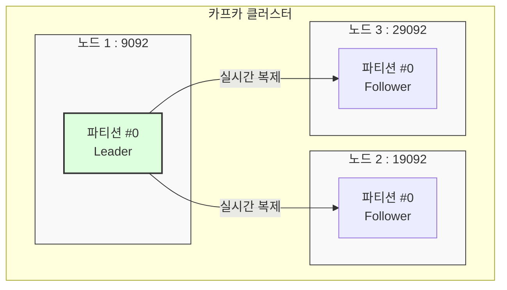

# [실습] 카프카 서버 3대 연동 확인하기

카프카 서버 3대가 서로 잘 연동되었는지 확인하는 가장 확실한 방법은, 서버 개수만큼 **레플리케이션(Replication)**을 가진 토픽을 생성해 보는 것이다.

---

## ✅ 실습 과정

### 1. 기존 리소스 정리
실습을 위해 기존에 실행 중인 프로듀서/컨슈머를 종료하고, 기존 토픽을 삭제한다.

```bash
# 1. 토픽 삭제
$ bin/kafka-topics.sh --bootstrap-server localhost:9092 --delete --topic email.send

# 2. 삭제 확인 (목록 조회)
$ bin/kafka-topics.sh --bootstrap-server localhost:9092 --list
```

### 2. 레플리케이션이 적용된 토픽 생성
`--replication-factor 3` 옵션을 사용하여 모든 노드에 데이터가 복제되도록 설정한다.

```bash
$ bin/kafka-topics.sh \
    --bootstrap-server localhost:9092 \
    --create \
    --topic email.send \
    --partitions 1 \
    --replication-factor 3
```

---

## ✅ 연동 결과 확인

### 1. 토픽 세부 정보 조회 (Describe)
생성된 토픽이 실제로 3대의 서버에 분산되어 있는지 확인한다.

```bash
$ bin/kafka-topics.sh \
    --bootstrap-server localhost:9092 \
    --describe \
    --topic email.send
```

**[실행 결과 예시]**
```text
Topic: email.send  TopicId: ... PartitionCount: 1  ReplicationFactor: 3  Configs: ...
    Topic: email.send  Partition: 0  Leader: 1  Replicas: 1, 2, 3  Isr: 1, 2, 3
```

- **Replicas**: 이 파티션의 데이터가 저장되어 있는 노드 번호 목록이다. (1, 2, 3번 노드에 모두 존재)
- **Isr (In-Sync Replicas)**: 현재 리더와 동기화가 잘 되어 있는 복제본 목록이다. 여기에 1, 2, 3이 모두 있다면 3대의 서버가 정상적으로 연동되어 실시간 복제를 수행하고 있다는 뜻이다.

### 2. 다른 브로커를 통한 접속 확인
9092 포트뿐만 아니라 다른 브로커 포트(19092, 29092)로도 토픽 정보를 조회할 수 있어야 한다.

```bash
# 노드 2를 통해 조회
$ bin/kafka-topics.sh --bootstrap-server localhost:19092 --describe --topic email.send

# 노드 3을 통해 조회
$ bin/kafka-topics.sh --bootstrap-server localhost:29092 --describe --topic email.send
```

---

## 📊 레플리케이션 구조 시각화


