# [실습] 카프카 서버 3대 연동 확인하기

카프카 서버 3대가 서로 잘 연동되었는지 확인하는 가장 확실한 방법은, 서버 개수만큼 **레플리케이션(Replication)**을 가진 토픽을 생성해 보는 것이다.

---

## ✅ 실습 과정

### 1. 기존 리소스 정리
실습을 위해 기존에 실행 중인 프로듀서/컨슈머를 종료하고, 기존 토픽을 삭제한다.

```bash
# 1. 토픽 삭제
$ bin/kafka-topics.sh --bootstrap-server localhost:9092 --delete --topic email.send

# 2. 삭제 확인 (목록 조회)
$ bin/kafka-topics.sh --bootstrap-server localhost:9092 --list
```

### 2. 레플리케이션이 적용된 토픽 생성
`--replication-factor 3` 옵션을 사용하여 모든 노드에 데이터가 복제되도록 설정한다.

```bash
$ bin/kafka-topics.sh \
    --bootstrap-server localhost:9092 \
    --create \
    --topic email.send \
    --partitions 1 \
    --replication-factor 3
```

---

## ✅ 연동 결과 확인

### 1. 토픽 세부 정보 조회 (Describe)
생성된 토픽이 실제로 3대의 서버에 분산되어 있는지 확인한다.

```bash
$ bin/kafka-topics.sh \
    --bootstrap-server localhost:9092 \
    --describe \
    --topic email.send
```

**[실행 결과 예시]**
```text
Topic: email.send  TopicId: ... PartitionCount: 1  ReplicationFactor: 3  Configs: ...
    Topic: email.send  Partition: 0  Leader: 1  Replicas: 1, 2, 3  Isr: 1, 2, 3
```

#### 💡 출력 항목의 의미
- **Leader**: 현재 읽기/쓰기를 담당하는 브로커 (위 예시에서는 1번 노드)
- **Replicas**: 이 파티션의 데이터가 저장되어 있는 노드 번호 목록 (1, 2, 3번 노드)
- **Isr (In-Sync Replicas)**: 현재 리더와 동기화가 완벽하게 되어 있는 복제본 목록이다. 여기에 1, 2, 3이 모두 있다면 3대의 서버가 정상적으로 연동되어 실시간 복제를 수행하고 있다는 뜻이다.

> 각 항목에 대한 더 자세한 설명은 [카프카 기본 아키텍처 - 토픽 세부 정보 해설](../03-architecture/Architecture.md#topic-describe-info)에서 확인할 수 있다.

### 2. 다른 브로커를 통한 접속 확인
9092 포트뿐만 아니라 다른 브로커 포트(19092, 29092)로도 토픽 정보를 조회할 수 있어야 한다.

```bash
# 노드 2를 통해 조회
$ bin/kafka-topics.sh --bootstrap-server localhost:19092 --describe --topic email.send

# 노드 3을 통해 조회
$ bin/kafka-topics.sh --bootstrap-server localhost:29092 --describe --topic email.send
```

---

## 📊 레플리케이션 구조 시각화

```mermaid
graph TD
    subgraph Kafka_Cluster [카프카 클러스터]
        subgraph Node1 [노드 1 : 9092]
            P0_L[파티션 #0<br/>Leader]
        end
        subgraph Node2 [노드 2 : 19092]
            P0_F1[파티션 #0<br/>Follower]
        end
        subgraph Node3 [노드 3 : 29092]
            P0_F2[파티션 #0<br/>Follower]
        end
    end

    P0_L -- "실시간 복제" --> P0_F1
    P0_L -- "실시간 복제" --> P0_F2

    style P0_L fill:#dfd,stroke:#333,stroke-width:2px
    style Node1 fill:#f9f9f9,stroke:#333
    style Node2 fill:#f9f9f9,stroke:#333
    style Node3 fill:#f9f9f9,stroke:#333
```



---

## ➡️ 다음 단계

3대의 서버가 연동된 것을 확인했다면, 리더가 아닌 팔로워 파티션이 있는 노드로 메시지를 보냈을 때 어떻게 처리되는지 확인해 본다.

- [[실습] 팔로워 파티션에 메시지 전송 테스트](./Follower-Message-Test.md)
