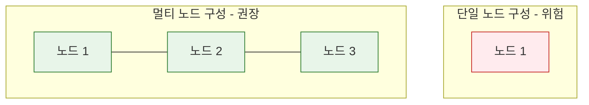
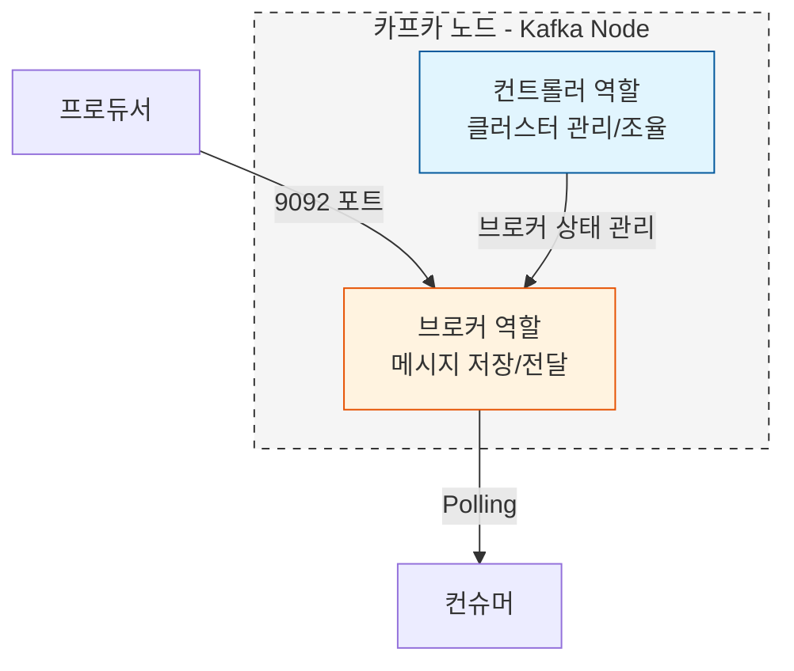
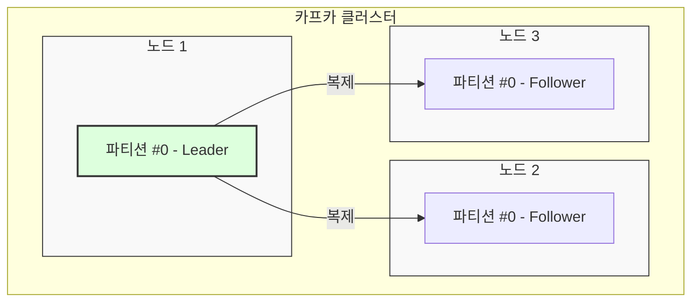

# 03. 카프카 기본 아키텍처

## 토픽(Topic)과 파티션(Partition)

### 토픽(Topic)이란?
카프카에서 **메시지의 종류를 구분하는 단위**이다. 파일 시스템의 폴더나 데이터베이스의 테이블과 유사한 개념으로, 특정 주제나 카테고리에 따라 메시지를 저장한다.

- **메시지 분류**: 프로듀서는 특정 토픽을 지정하여 메시지를 전송하고, 컨슈머는 관심 있는 토픽을 구독하여 데이터를 소비한다.
- **데이터 저장**: 카프카는 전달받은 메시지를 토픽별로 구분하여 메시지 큐에 안전하게 저장한다.

---

## 카프카의 기본 구성 요소 (Producer, Consumer, Topic) <a name="components"></a>

카프카의 전체적인 동작 흐름은 **프로듀서**, **컨슈머**, 그리고 **토픽** 간의 상호작용으로 이루어진다.


1. **프로듀서(Producer)**: 카프카(토픽)에 메시지(데이터)를 전달하는 주체이다.
2. **카프카 토픽(Topic)**: 전달받은 메시지를 카테고리별로 구분하여 보관하는 임시 저장소이다.
3. **컨슈머(Consumer)**: 카프카에 새로운 메시지가 생겼는지 주기적으로 체크(Polling)하다가, 데이터가 있으면 가져와서 처리하는 주체이다.

---

## CLI를 활용한 토픽 관리 <a name="topic-cli"></a>

실제 운영 환경이나 실습 시 CLI(Command Line Interface)를 통해 토픽을 직접 생성하고 관리할 수 있다.

### 1. 토픽 생성하기
`kafka-topics.sh` 스크립트에 `--create` 옵션을 사용하여 새로운 토픽을 생성한다.

```bash
# kafka 디렉터리 안에서 실행 (예: kafka_2.13-4.0.0)
$ bin/kafka-topics.sh \
    --bootstrap-server localhost:9092 \
    --create \
    --topic email.send
```

**실행 결과:**
```text
Created topic email.send.
```

### 2. 토픽 조회하기
생성된 토픽의 목록을 확인하거나 특정 토픽의 상세 정보를 조회한다.

**전체 목록 조회:**
```bash
$ bin/kafka-topics.sh \
    --bootstrap-server localhost:9092 \
    --list
```

**실행 결과 (예시):**
```text
__consumer_offsets
email.send
```

**특정 토픽 상세 정보 조회:**
```bash
$ bin/kafka-topics.sh \
    --bootstrap-server localhost:9092 \
    --describe --topic email.send
```

**실행 결과 (예시):**
```text
Topic: email.send  TopicId: ... PartitionCount: 1  ReplicationFactor: 3  Configs: ...
    Topic: email.send  Partition: 0  Leader: 1  Replicas: 1, 2, 3  Isr: 1, 2, 3
```

#### 📊 토픽 세부 정보 항목 해설 <a name="topic-describe-info"></a>
위 `describe` 명령어를 통해 출력되는 항목들의 의미는 다음과 같다.

- **PartitionCount**: 해당 토픽이 가진 전체 파티션의 개수이다.
- **ReplicationFactor**: 해당 토픽의 각 파티션이 복제된 개수(원본 포함)이다.
- **Partition**: 현재 행이 설명하고 있는 파티션 번호이다.
- **Leader**: 해당 파티션의 **리더(원본)** 역할을 수행하고 있는 브로커의 ID이다. 모든 읽기/쓰기 요청은 이 브로커를 통해 처리된다.
    - **[복습] 리더 파티션(Leader Partition)이란?**
        - 복제된 파티션들은 **리더 파티션(원본)**과 **팔로워 파티션(복제본)**으로 구분된다.
        - 리더 파티션은 프로듀서나 컨슈머가 직접적으로 메시지를 쓰고 읽는 파티션이다. 반면에 팔로워 파티션은 프로듀서나 컨슈머가 직접적으로 메시지를 쓰고 읽지 않는다.
        - 팔로워 파티션은 리더 파티션의 메시지를 실시간으로 복제하며 유지한다.
        - 리더 파티션에 장애가 발생하면 팔로워 파티션이 리더 역할(프로듀서로부터 메시지를 받고, 컨슈머가 메시지를 처리)을 대신 수행한다. 이미 팔로워 파티션은 리더 파티션 내부에 있는 메시지까지 복제해서 가지고 있기 때문에, 리더 파티션의 노드가 중간에 장애가 난다고 하더라도 메시지는 정상적으로 이어서 처리할 수 있다.
- **Replicas**: 해당 파티션의 데이터가 복제되어 저장되어 있는 모든 브로커 ID의 목록이다.
- **Isr (In-Sync Replicas)**: 리더 파티션과 똑같은 상태로 복제(동기화)가 완료된 노드들의 ID 목록이다. ISR에 포함된 팔로워만이 리더 장애 시 차기 리더가 될 자격이 있다.

### 3. 토픽 삭제하기
더 이상 사용하지 않는 토픽을 삭제한다.

```bash
$ bin/kafka-topics.sh \
    --bootstrap-server localhost:9092 \
    --delete --topic email.send
```

**실행 결과:**
```text
Topic email.send is marked for deletion.
Note: This will have no impact if delete.topic.enable is not set to true.
```

---

## 노드(node), 브로커(broker), 컨트롤러(controller), 클러스터(cluster) <a name="broker"></a>

카프카의 **고가용성**(시스템이 장애 상황에서도 멈추지 않고 정상적으로 서비스를 제공할 수 있는 능력)을 확보하기 위해 반드시 알아야 할 용어들이다.

### ✅ 노드(node)란?
**노드(node)**란, **카프카가 설치되어 있는 서버 단위**를 의미한다. 전체 프로그래밍 분야에서 널리 쓰이는 개념이며, 카프카에서는 카프카 소프트웨어가 실행되는 물리적/가상 서버 한 대를 의미한다.



- **장애 상황**: 노드가 1대뿐일 때 해당 노드가 고장나면 서비스 전체가 중단된다.
- **고가용성**: 실무에서는 최소 3대의 노드를 구성하여 한 대가 고장나더라도 중단 없이 작동하게 만든다.

### ✅ 클러스터(cluster)란?
**클러스터(cluster)**란, **여러 대의 서버가 연결되어 하나의 시스템처럼 동작하는 서버들의 집합**을 의미한다.

- 여러 노드가 유기적으로 작동하여 메시지를 나눠 저장하고 복제본을 유지한다.
- 장애 시에도 시스템 전체가 중단 없이 작동하도록 보장한다.

### ✅ 브로커(broker)와 컨트롤러(controller)란?
카프카 서버 프로세스는 크게 **브로커**와 **컨트롤러**라는 두 가지 핵심 역할을 수행한다.



1. **브로커(broker)**: **메시지를 저장하고 클라이언트의 요청을 처리하는 역할**을 한다. (비유하자면 실무를 담당하는 **직원**)
   - 기본적으로 9092 포트를 사용한다.
2. **컨트롤러(controller)**: **브로커들 간의 연동과 전반적인 클러스터의 상태를 총괄**한다. (비유하자면 **총관리자**)
   - 기본적으로 9093 포트를 사용하며, 별개의 프로세스로 실행된다.

> **실습 안내**: 실제로 하나의 서버에 여러 개의 브로커와 컨트롤러를 띄워 클러스터를 구성하는 방법은 [[실습] 카프카 서버 총 3대 셋팅하기](../02-setup/Multi-Broker-Setup.md)에서 확인할 수 있다.

### ✅ [종합] 파티션 분산과 리더/팔로워 동작 구조

지금까지 배운 파티션, 복제(Replication), 리더와 팔로워의 관계를 하나의 그림으로 정리하면 다음과 같다.

```mermaid
graph TD
    subgraph Producers [프로듀서]
        P1[프로듀서 App]
    end

    subgraph KafkaCluster [카프카 클러스터 (3 Nodes, RF=3)]
        direction TB
        subgraph Node1 [노드 1]
            direction TB
            P0L[<b>P0 Leader</b>]
            P1F1[P1 Follower]
            P2F1[P2 Follower]
        end
        subgraph Node2 [노드 2]
            direction TB
            P1L[<b>P1 Leader</b>]
            P0F1[P0 Follower]
            P2F2[P2 Follower]
        end
        subgraph Node3 [노드 3]
            direction TB
            P2L[<b>P2 Leader</b>]
            P0F2[P0 Follower]
            P1F2[P1 Follower]
        end
    end

    subgraph Consumers [컨슈머 그룹]
        C1[컨슈머 1]
        C2[컨슈머 2]
        C3[컨슈머 3]
    end

    %% 프로듀서는 각 파티션의 리더에게 메시지 전송
    P1 -- "1. 메시지 분산 전송 (P0)" --> P0L
    P1 -- "1. 메시지 분산 전송 (P1)" --> P1L
    P1 -- "1. 메시지 분산 전송 (P2)" --> P2L

    %% 리더에서 팔로워로 복제
    P0L -. "2. 데이터 복제" .-> P0F1
    P0L -. "2. 데이터 복제" .-> P0F2
    P1L -. "2. 데이터 복제" .-> P1F1
    P1L -. "2. 데이터 복제" .-> P1F2
    P2L -. "2. 데이터 복제" .-> P2F1
    P2L -. "2. 데이터 복제" .-> P2F2

    %% 컨슈머는 리더로부터 메시지 읽기
    P0L -- "3. 메시지 읽기" --> C1
    P1L -- "3. 메시지 읽기" --> C2
    P2L -- "3. 메시지 읽기" --> C3

    %% 스타일 설정
    style P0L fill:#dfd,stroke:#333,stroke-width:3px
    style P1L fill:#dfd,stroke:#333,stroke-width:3px
    style P2L fill:#dfd,stroke:#333,stroke-width:3px
    style Node1 fill:#ffffff,stroke:#e65100
    style Node2 fill:#ffffff,stroke:#e65100
    style Node3 fill:#ffffff,stroke:#e65100
    style KafkaCluster fill:#fff3e0,stroke:#e65100
```

#### 📊 그림으로 이해하는 핵심 동작
1.  **파티션 분산 (Load Balancing)**:
    *   하나의 토픽이 여러 개의 파티션(P0, P1, P2)으로 나뉘어 여러 노드에 분산 배치된다.
    *   프로듀서는 메시지를 보낼 때 특정 파티션 규칙(라운드 로빈 등)에 따라 각 파티션의 **리더**에게 데이터를 나누어 보낸다.
2.  **리더와 팔로워 (Replication)**:
    *   각 파티션은 하나의 **리더(Leader)**와 여러 개의 **팔로워(Follower)**를 가진다.
    *   **리더**: 모든 읽기/쓰기 작업이 일어나는 실제 원본이다 (그림의 진한 초록색).
    *   **팔로워**: 리더의 데이터를 실시간으로 복제하여 유지하는 복제본이다.
3.  **데이터 복제 (Synchronization)**:
    *   프로듀서가 리더에게 메시지를 쓰면, 팔로워들은 리더로부터 데이터를 가져와 자신의 디스크에 복제한다.
4.  **컨슈머 읽기**:
    *   컨슈머 역시 각 파티션의 **리더**로부터 메시지를 읽어와 처리한다.
    *   파티션이 여러 개이므로 여러 컨슈머가 병렬로 나누어 처리할 수 있어 성능이 향상된다.

이 구조 덕분에 특정 노드(서버)가 고장 나더라도, 다른 노드에 있는 팔로워 파티션이 즉시 리더로 승격되어 서비스 중단 없이 데이터를 안전하게 보호할 수 있다.

---

## 리플리케이션(Replication)과 ISR <a name="replication"></a>

### ✅ 리플리케이션(replication)이란?
카프카에서의 **레플리케이션(replication)**은 데이터의 안정성과 가용성을 높이기 위해 **토픽의 파티션을 여러 노드에 복제하는 것**을 의미한다.



- **리더 파티션 (Leader)**: 프로듀서나 컨슈머가 직접적으로 메시지를 쓰고 읽는 원본 파티션이다.
- **팔로워 파티션 (Follower)**: 리더의 데이터를 실시간으로 복제하여 유지하는 복제본이다. 평상시에는 읽기/쓰기에 관여하지 않는다.

### ✅ 리플리케이션의 동작과 장점
1. **고가용성 보장**: 리더 파티션이 있는 노드에 장애가 발생하면, 팔로워 중 하나가 새로운 리더 역할을 즉시 승계한다.
2. **데이터 유실 방지**: 이미 팔로워가 데이터를 복제해 두었기 때문에 장애가 발생해도 메시지를 정상적으로 이어서 처리할 수 있다.
3. **설정**: 실무에서는 보통 레플리케이션 개수(Replication Factor)를 **2 또는 3**으로 설정하여 활용한다.
