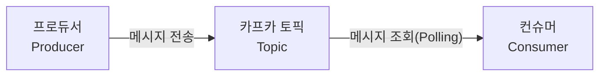

# 03. 카프카 기본 아키텍처

## 토픽(Topic)과 파티션(Partition)

### 토픽(Topic)이란?
카프카에서 **메시지의 종류를 구분하는 단위**입니다. 파일 시스템의 폴더나 데이터베이스의 테이블과 유사한 개념으로, 특정 주제나 카테고리에 따라 메시지를 저장합니다.

- **메시지 분류**: 프로듀서는 특정 토픽을 지정하여 메시지를 전송하고, 컨슈머는 관심 있는 토픽을 구독하여 데이터를 소비합니다.
- **데이터 저장**: 카프카는 전달받은 메시지를 토픽별로 구분하여 메시지 큐에 안전하게 저장합니다.

---

## 카프카의 기본 구성 요소 (Producer, Consumer, Topic) 

카프카의 전체적인 동작 흐름은 **프로듀서**, **컨슈머**, 그리고 **토픽** 간의 상호작용으로 이루어집니다.

1. **프로듀서(Producer)**: 카프카(토픽)에 메시지(데이터)를 전달하는 주체입니다.
2. **카프카 토픽(Topic)**: 전달받은 메시지를 카테고리별로 구분하여 보관하는 임시 저장소입니다.
3. **컨슈머(Consumer)**: 카프카에 새로운 메시지가 생겼는지 주기적으로 체크(Polling)하다가, 데이터가 있으면 가져와서 처리하는 주체입니다.

---

## 브로커(Broker)와 클러스터(Cluster) 

## 리플리케이션(Replication)과 ISR 
