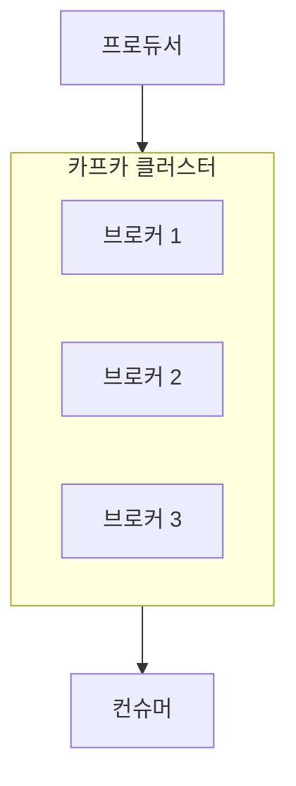

# 03. 카프카 기본 아키텍처

## 토픽(Topic)과 파티션(Partition)

### 토픽(Topic)이란?
카프카에서 **메시지의 종류를 구분하는 단위**이다. 파일 시스템의 폴더나 데이터베이스의 테이블과 유사한 개념으로, 특정 주제나 카테고리에 따라 메시지를 저장한다.

- **메시지 분류**: 프로듀서는 특정 토픽을 지정하여 메시지를 전송하고, 컨슈머는 관심 있는 토픽을 구독하여 데이터를 소비한다.
- **데이터 저장**: 카프카는 전달받은 메시지를 토픽별로 구분하여 메시지 큐에 안전하게 저장한다.

---

## 카프카의 기본 구성 요소 (Producer, Consumer, Topic) <a name="components"></a>

카프카의 전체적인 동작 흐름은 **프로듀서**, **컨슈머**, 그리고 **토픽** 간의 상호작용으로 이루어진다.


1. **프로듀서(Producer)**: 카프카(토픽)에 메시지(데이터)를 전달하는 주체이다.
2. **카프카 토픽(Topic)**: 전달받은 메시지를 카테고리별로 구분하여 보관하는 임시 저장소이다.
3. **컨슈머(Consumer)**: 카프카에 새로운 메시지가 생겼는지 주기적으로 체크(Polling)하다가, 데이터가 있으면 가져와서 처리하는 주체이다.

---

## CLI를 활용한 토픽 관리 <a name="topic-cli"></a>

실제 운영 환경이나 실습 시 CLI(Command Line Interface)를 통해 토픽을 직접 생성하고 관리할 수 있다.

### 1. 토픽 생성하기
`kafka-topics.sh` 스크립트에 `--create` 옵션을 사용하여 새로운 토픽을 생성한다.

```bash
# kafka 디렉터리 안에서 실행 (예: kafka_2.13-4.0.0)
$ bin/kafka-topics.sh \
    --bootstrap-server localhost:9092 \
    --create \
    --topic email.send
```

### 2. 토픽 조회하기
생성된 토픽의 목록을 확인하거나 특정 토픽의 상세 정보를 조회한다.

**전체 목록 조회:**
```bash
$ bin/kafka-topics.sh \
    --bootstrap-server localhost:9092 \
    --list
```

**특정 토픽 상세 정보 조회:**
```bash
$ bin/kafka-topics.sh \
    --bootstrap-server localhost:9092 \
    --describe --topic email.send
```

### 3. 토픽 삭제하기
더 이상 사용하지 않는 토픽을 삭제한다.

```bash
$ bin/kafka-topics.sh \
    --bootstrap-server localhost:9092 \
    --delete --topic email.send
```

---

## 브로커(Broker)와 클러스터(Cluster) <a name="broker"></a>

### 브로커(Broker)란?
**브로커(Broker)**는 **카프카 서비스가 설치되어 실행 중인 서버**를 의미한다. 하나의 카프카 서버를 하나의 브로커라고 부르며, 브로커는 프로듀서로부터 메시지를 전달받아 저장하고, 컨슈머에게 메시지를 전달하는 핵심적인 역할을 수행한다.

- **메시지 저장**: 브로커는 전달받은 메시지를 로컬 디스크에 안전하게 보관한다.
- **데이터 관리**: 토픽과 파티션을 관리하며, 데이터의 영속성을 보장한다.

### 클러스터(Cluster)란?
**클러스터(Cluster)**는 **여러 개의 브로커가 하나로 묶여 있는 상태**를 의미한다. 카프카는 대규모 데이터를 안전하고 빠르게 처리하기 위해 여러 대의 서버(브로커)를 클러스터로 구성하여 운영한다.

- **고가용성**: 특정 브로커에 장애가 발생하더라도 다른 브로커가 역할을 대신하여 중단 없는 서비스를 제공한다.
- **확장성**: 데이터의 양이 늘어나면 브로커를 추가하여 클러스터의 전체 성능과 용량을 손쉽게 확장할 수 있다.



---

## 리플리케이션(Replication)과 ISR <a name="replication"></a>
