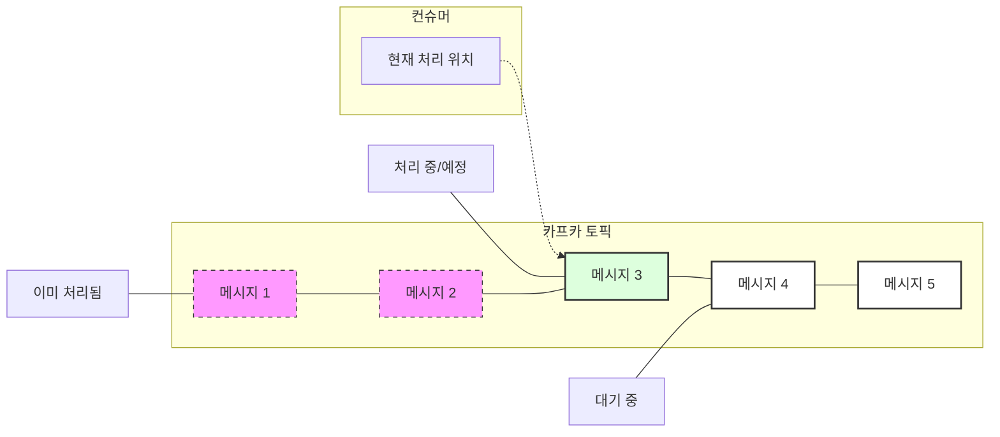
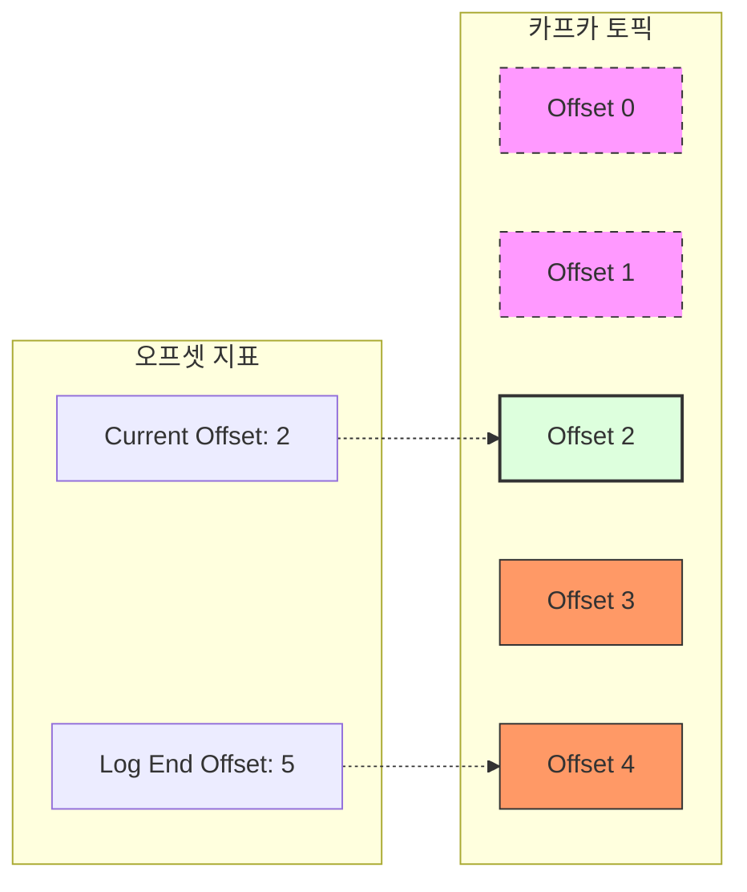
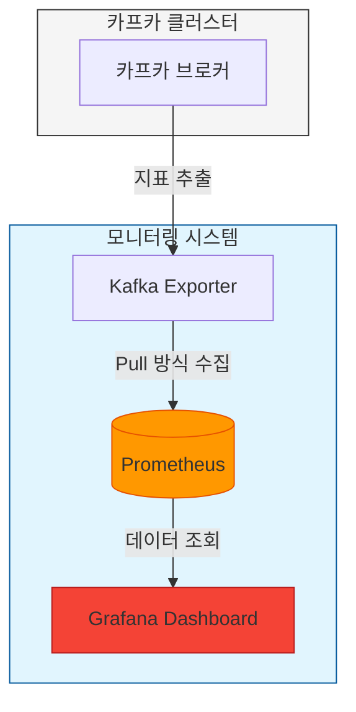

# 04. 컨슈머 랙 (Consumer Lag)

컨슈머가 메시지를 지연 없이 잘 처리하고 있는 지 확인하는 방법인 컨슈머 랙(Consumer Lag)에 대해 알아본다.

## ✅ Lag 이란? <a name="what-is-lag"></a>

평소에 컴퓨터가 느려지거나 버벅거리면 우리는 “렉 걸린다”라는 표현을 쓴다. 이 때, 렉이라는 단어는 영어 단어인 **Lag**을 한글로 읽은 것이다. Lag의 뜻은 **‘지연, delay’**의 의미를 가진다.

카프카에서 사용하는 **랙(Lag)**의 의미는, **지연된 메시지 수(컨슈머가 아직 처리하지 못한 메시지 수)**이다. 다른 말로, **컨슈머 랙(Consumer Lag)**이라고도 부른다.



> **Consumer Lag**: 위 그림에서 아직 컨슈머가 도달하지 못한 **메시지 4, 5**가 바로 랙(Lag)에 해당한다. (Lag = 2)

---

## ✅ 컨슈머 랙(Consumer Lag)은 언제 발생할까? <a name="when-lag-occurs"></a>

프로듀서의 메시지 생산량보다 컨슈머의 메시지 처리량이 작을 때 컨슈머 랙(Consumer Lag)이 발생한다.

- **예시**: 메시지가 1초에 3개씩 생기는데 1초에 메시지를 1개씩 밖에 처리를 못한다면, 1초 당 2개의 메시지가 계속해서 쌓이게 된다.

### 실제 발생 사례
- 갑작스러운 서비스 요청(트래픽) 증가
- 컨슈머 애플리케이션의 장애 발생
- 컨슈머의 처리 로직이 비효율적일 때

컨슈머 랙이 발생했다는 건 메시지 처리가 지연되고 있다는 뜻이다. 이메일 발송 작업을 예로 들면, 사용자가 발송 버튼을 눌렀는데 처리되지 못한 메시지들이 밀려있어 이메일이 실제 발송되기까지 오랜 시간이 걸릴 수 있다.

따라서 컨슈머 랙이 지속적으로 늘어나고 있다면 빠르게 조치를 취해야 한다.

---

## ✅ 컨슈머 랙(Consumer Lag) 확인하는 방법 <a name="how-to-check-lag"></a>

### 1. CLI로 컨슈머 랙 확인하기
`kafka-consumer-groups.sh` 명령어를 사용하여 컨슈머 그룹의 상세 정보를 조회하면 랙을 확인할 수 있다.

```bash
$ bin/kafka-consumer-groups.sh \
    --bootstrap-server localhost:9092 \
    --group email-send-group \
    --describe
```

**실행 결과 예시:**
```text
GROUP            TOPIC           PARTITION  CURRENT-OFFSET  LOG-END-OFFSET  LAG             CONSUMER-ID     HOST            CLIENT-ID
email-send-group email.send      0          2               4               2               -               -               -
email-send-group email.send      1          3               4               1               -               -               -
email-send-group email.send      2          3               4               1               -               -               -
```

- **LOG-END-OFFSET**: 프로듀서가 보낸 마지막 메시지의 오프셋 (현재 토픽에 쌓인 메시지 수 관련)
- **CURRENT-OFFSET**: 컨슈머가 마지막으로 처리를 완료한 오프셋
- **LAG**: `LOG-END-OFFSET` - `CURRENT-OFFSET`. 즉, 아직 처리되지 않고 남아있는 메시지의 수다.



---

## ✅ 현업에서의 컨슈머 랙(Consumer Lag) 체크 방법 <a name="production-check"></a>

매번 CLI로 수동 확인하는 것은 불가능하므로, 현업에서는 자동화된 모니터링 시스템을 구축한다.

### 1. 외부 모니터링 툴 사용하기
지속적으로 랙을 모니터링하고, 특정 임계치를 넘어가면 알림(Slack, Email 등)을 발송하도록 설정한다.
- **Datadog**: 강력한 기능을 제공하는 유료 모니터링 서비스
- **Burrow**: 링크드인에서 공개한 오픈소스 컨슈머 랙 체크 툴 (무료)
- **Prometheus & Grafana**: 지표를 수집하고 시각화하는 가장 대중적인 오픈소스 조합 (무료)



### 2. 매니지드 서비스(Managed Service) 모니터링 활용
카프카를 직접 구축하지 않고 클라우드 서비스를 사용하는 경우, 자체 모니터링 기능을 활용한다.
- **AWS MSK**: CloudWatch를 통해 컨슈머 랙 지표 제공
- **Confluent Cloud**: 대시보드에서 실시간 컨슈머 랙 확인 가능
