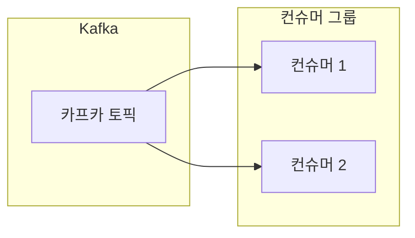

# 04. 컨슈머 (Consumer)

## 컨슈머와 컨슈머 그룹(Consumer Group) <a name="consumer"></a>

### 컨슈머(Consumer)란?
**메시지를 소비하는 주체**를 의미한다. 카프카에 저장되어 있는 메시지를 꺼내와서 실제로 필요한 로직(비즈니스 로직)을 수행하는 역할을 한다.

### CLI를 활용한 메시지 조회 (Consumer)
`kafka-console-consumer.sh` 스크립트를 사용하여 토픽에 쌓인 메시지를 실시간으로 조회하거나 처음부터 읽어올 수 있다.

**처음부터 모든 메시지 읽기:**
```bash
$ bin/kafka-console-consumer.sh \
    --bootstrap-server localhost:9092 \
    --topic email.send \
    --from-beginning
```
- `--from-beginning`: 토픽의 가장 처음 메시지부터 출력한다.

---

### 컨슈머 그룹 (Consumer Group) <a name="consumer-group"></a>
컨슈머들은 보통 **컨슈머 그룹**이라는 단위로 묶여서 동작한다.
- **메시지 소비 위치 기록**: 각 컨슈머 그룹은 어디까지 메시지를 읽었는지 **오프셋(Offset)**이라는 번호로 기록한다.
- **분산 처리**: 대규모 데이터를 처리하기 위해 여러 컨슈머가 메시지를 나누어서 처리할 수 있다.
- **고가용성**: 그룹 내의 한 컨슈머에 장애가 발생하더라도 다른 컨슈머가 작업을 이어받아 처리할 수 있다.


