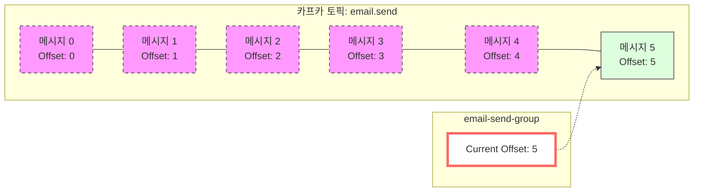
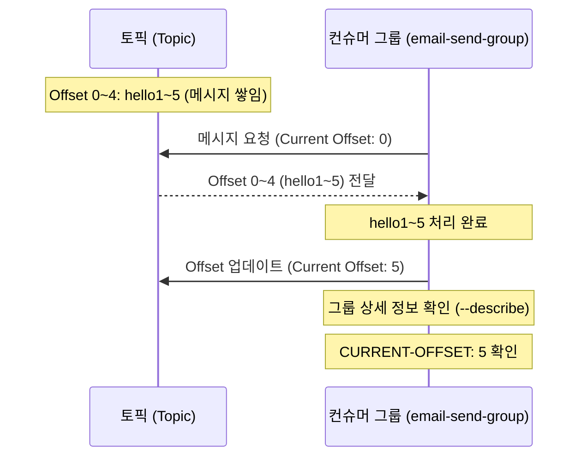

# 04. 오프셋 관리 (Offset Management)

## 오프셋(Offset)과 소비 지점 관리 <a name="offset"></a>

### 오프셋(Offset)이란?
카프카 토픽에 저장된 메시지의 순서를 나타내는 **고유 번호**이다.
- 인덱스처럼 **0부터 시작**한다.
- 컨슈머 그룹은 다음에 읽을 메시지의 번호인 `CURRENT-OFFSET`을 관리한다.

### [실습] 컨슈머 그룹을 지정해서 메시지 읽기

컨슈머 그룹을 지정하면, 그룹별로 독립적인 오프셋 관리가 가능하다.

**1. 그룹을 지정하여 메시지 소비:**
```bash
# email-send-group이라는 그룹으로 메시지 읽기
$ bin/kafka-console-consumer.sh \
    --bootstrap-server localhost:9092 \
    --topic email.send \
    --from-beginning \
    --group email-send-group
```
- `--group email-send-group`: 기존 그룹이 없으면 생성하고, 오프셋 기록이 있으면 그 이후부터 읽는다.

**2. 컨슈머 그룹 목록 확인:**
```bash
$ bin/kafka-consumer-groups.sh \
    --bootstrap-server localhost:9092 \
    --list
```

**3. 특정 그룹의 상세 정보 및 오프셋 확인:**
```bash
$ bin/kafka-consumer-groups.sh \
    --bootstrap-server localhost:9092 \
    --group email-send-group \
    --describe

# 실행 결과 예시
Consumer group 'email-send-group' has no active members.

GROUP            TOPIC           PARTITION  CURRENT-OFFSET  LOG-END-OFFSET  LAG             CONSUMER-ID     HOST            CLIENT-ID
email-send-group email.send      0          5               5               0               -               -               -
```
- `CURRENT-OFFSET`: 해당 그룹이 마지막으로 읽고 처리를 완료한 오프셋 번호(다음에 읽을 번호)를 나타낸다.
- 위 결과에서는 오프셋 4까지의 메시지(총 5개)를 읽었으므로 `CURRENT-OFFSET`이 5로 표시된다.

### 오프셋(Offset) 시각화
토픽 내에서 메시지가 쌓이는 구조와 컨슈머 그룹의 오프셋 추적을 시각화하면 다음과 같다.



- **점선 박스**: 이미 처리가 완료된 메시지들이다.
- **실선 박스 (Offset 5)**: 다음에 읽어야 할 메시지 지점이다.
- **Current Offset**: 컨슈머 그룹이 '다음에 읽을 번호'를 가리키고 있는 상태이다.

---

## 안 읽은 메시지부터 처리하기 (순차적 처리) <a name="sequential-processing"></a>

컨슈머 그룹을 활용하는 가장 큰 이유는 **중복 처리를 방지**하고 **안 읽은 메시지부터 이어서 처리**하기 위함이다.

1. **메시지 추가**: 프로듀서가 새로운 메시지(`hello5`)를 보낸다. (현재 오프셋 4)
2. **이어서 읽기**: 이전에 사용했던 그룹(`email-send-group`)으로 다시 실행하면, 이미 읽은 `hello1~4`는 건너뛰고 `hello5`부터 가져온다.
3. **오프셋 업데이트**: 처리가 완료되면 `CURRENT-OFFSET`이 5로 업데이트된다.



### 정리
실제 서비스에서는 동일한 요청의 중복 처리를 막기 위해 반드시 **컨슈머 그룹**을 활용해야 한다. 오프셋을 통해 처리 상태를 기억함으로써 안정적인 시스템 운영이 가능하다.
