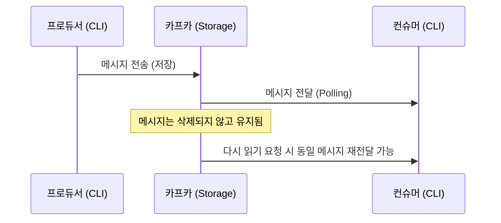

# 04. 프로듀서 (Producer)

## 프로듀서의 역할과 메시지 전송 방식 <a name="producer"></a>

### 프로듀서(Producer)란?
**메시지를 생산하는 주체**를 의미한다. 사용자의 요청을 받아 카프카(Kafka)라는 메시지 큐에 전달할 메시지를 생성하고 전송하는 역할을 수행한다.

### CLI를 활용한 메시지 전송 (Producer)
`kafka-console-producer.sh` 스크립트를 사용하여 CLI 환경에서 직접 메시지를 전송할 수 있다.

```bash
# 특정 토픽(email.send)에 메시지 넣기
$ bin/kafka-console-producer.sh \
    --bootstrap-server localhost:9092 \
    --topic email.send

# 명령어 입력 후 전송할 메시지 작성 (Enter로 구분)
> hello1
> hello2
> hello3

# 종료: Ctrl + C
```

---

## 카프카의 메시지 보관 방식 (Persistence) <a name="persistence"></a>

전통적인 메시지 큐(RabbitMQ, SQS 등)는 메시지를 읽으면 큐에서 삭제하는 방식이다. 하지만 **카프카는 메시지를 읽어도 제거하지 않고 저장소에 유지**한다.

1. **읽기 작업**: 저장된 메시지를 단순히 '읽기'만 한다.
2. **다시 읽기 가능**: 메시지가 삭제되지 않으므로, `--from-beginning` 옵션을 사용하면 언제든 다시 읽어올 수 있다.
3. **실시간 동기화**: 컨슈머가 켜져 있는 상태에서 프로듀서가 새로운 메시지를 보내면 실시간으로 화면에 출력되는 것을 확인할 수 있다.


