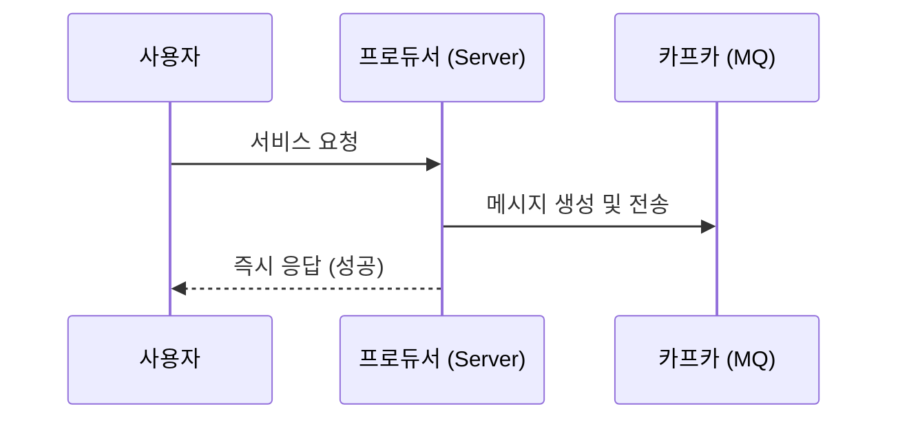
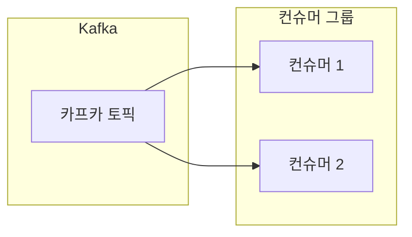

# 04. 프로듀서와 컨슈머

## 프로듀서의 역할과 메시지 전송 방식 

### 프로듀서(Producer)란?
**메시지를 생산하는 주체**를 의미합니다. 사용자의 요청을 받아 카프카(Kafka)라는 메시지 큐에 전달할 메시지를 생성하고 전송하는 역할을 수행합니다.

### 프로듀서의 핵심 동작
1. **메시지 생성**: 처리해야 할 작업 정보(예: 이메일 발송 정보, 로그 데이터 등)를 담은 메시지를 만듭니다.
2. **메시지 전송**: 생성된 메시지를 카프카의 특정 토픽으로 전송합니다.
3. **비동기적 응답**: 카프카에 메시지를 전달한 직후, 실제 작업 완료 여부와 상관없이 사용자에게 즉시 응답을 보낼 수 있습니다.

---

## 컨슈머와 컨슈머 그룹(Consumer Group) 

### 컨슈머(Consumer)란?
**메시지를 소비하는 주체**를 의미합니다. 카프카에 저장되어 있는 메시지를 꺼내와서 실제로 필요한 로직(비즈니스 로직)을 수행하는 역할을 합니다.

### 컨슈머의 핵심 동작
1. **메시지 폴링(Polling)**: 카프카로부터 메시지를 지속적으로 가져옵니다.
2. **작업 수행**: 가져온 메시지에 담긴 정보를 바탕으로 실제 작업(예: 이메일 발송, 데이터 저장 등)을 처리합니다.
3. **오프셋 업데이트**: 어디까지 메시지를 읽었는지 기록하여 중복 처리를 방지하거나 장애 복구 시 활용합니다.

### 컨슈머 그룹 (Consumer Group)
컨슈머들은 보통 **컨슈머 그룹**이라는 단위로 묶여서 동작합니다.
- **분산 처리**: 대규모 데이터를 처리하기 위해 여러 컨슈머가 메시지를 나누어서 처리할 수 있습니다.
- **고가용성**: 그룹 내의 한 컨슈머에 장애가 발생하더라도 다른 컨슈머가 작업을 이어받아 처리할 수 있습니다.

