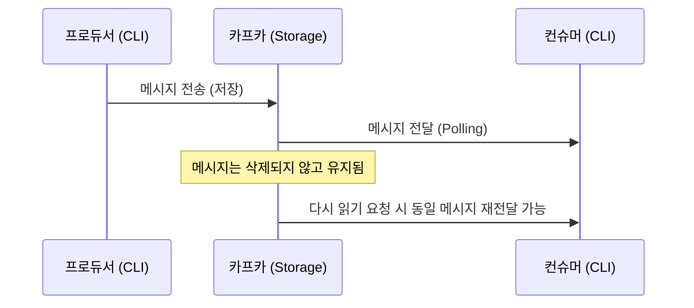
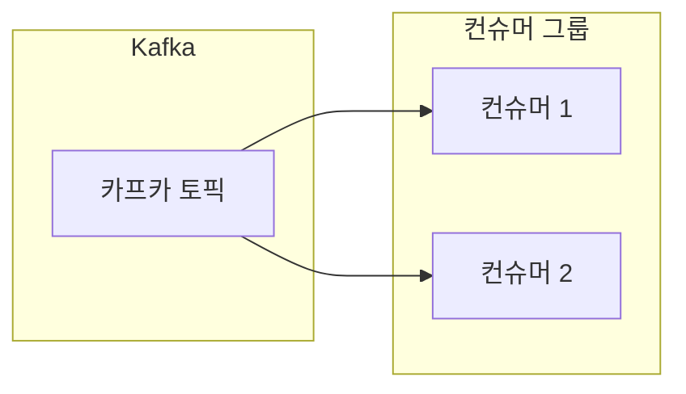
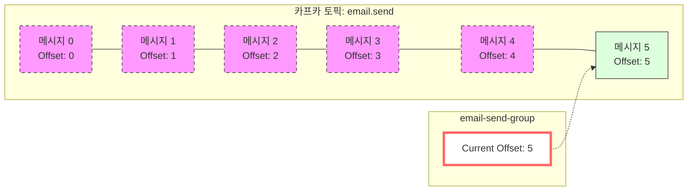
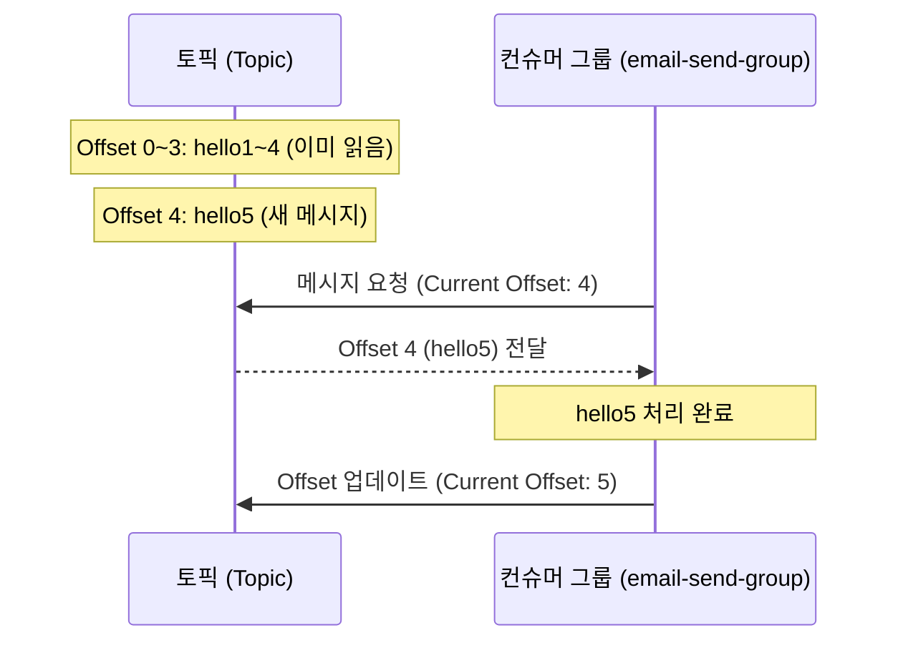

# 04. 프로듀서와 컨슈머

## 프로듀서의 역할과 메시지 전송 방식 <a name="producer"></a>

### 프로듀서(Producer)란?
**메시지를 생산하는 주체**를 의미합니다. 사용자의 요청을 받아 카프카(Kafka)라는 메시지 큐에 전달할 메시지를 생성하고 전송하는 역할을 수행합니다.

### CLI를 활용한 메시지 전송 (Producer)
`kafka-console-producer.sh` 스크립트를 사용하여 CLI 환경에서 직접 메시지를 전송할 수 있습니다.

```bash
# 특정 토픽(email.send)에 메시지 넣기
$ bin/kafka-console-producer.sh \
    --bootstrap-server localhost:9092 \
    --topic email.send

# 명령어 입력 후 전송할 메시지 작성 (Enter로 구분)
> hello1
> hello2
> hello3

# 종료: Ctrl + C
```

---

## 컨슈머와 컨슈머 그룹(Consumer Group) <a name="consumer"></a>

### 컨슈머(Consumer)란?
**메시지를 소비하는 주체**를 의미합니다. 카프카에 저장되어 있는 메시지를 꺼내와서 실제로 필요한 로직(비즈니스 로직)을 수행하는 역할을 합니다.

### CLI를 활용한 메시지 조회 (Consumer)
`kafka-console-consumer.sh` 스크립트를 사용하여 토픽에 쌓인 메시지를 실시간으로 조회하거나 처음부터 읽어올 수 있습니다.

**처음부터 모든 메시지 읽기:**
```bash
$ bin/kafka-console-consumer.sh \
    --bootstrap-server localhost:9092 \
    --topic email.send \
    --from-beginning
```
- `--from-beginning`: 토픽의 가장 처음 메시지부터 출력합니다.

---

## 카프카의 메시지 보관 방식 (Persistence) <a name="persistence"></a>

전통적인 메시지 큐(RabbitMQ, SQS 등)는 메시지를 읽으면 큐에서 삭제하는 방식입니다. 하지만 **카프카는 메시지를 읽어도 제거하지 않고 저장소에 유지**합니다.

1. **읽기 작업**: 저장된 메시지를 단순히 '읽기'만 합니다.
2. **다시 읽기 가능**: 메시지가 삭제되지 않으므로, `--from-beginning` 옵션을 사용하면 언제든 다시 읽어올 수 있습니다.
3. **실시간 동기화**: 컨슈머가 켜져 있는 상태에서 프로듀서가 새로운 메시지를 보내면 실시간으로 화면에 출력되는 것을 확인할 수 있습니다.



### 컨슈머 그룹 (Consumer Group) <a name="consumer-group"></a>
컨슈머들은 보통 **컨슈머 그룹**이라는 단위로 묶여서 동작합니다.
- **메시지 소비 위치 기록**: 각 컨슈머 그룹은 어디까지 메시지를 읽었는지 **오프셋(Offset)**이라는 번호로 기록합니다.
- **분산 처리**: 대규모 데이터를 처리하기 위해 여러 컨슈머가 메시지를 나누어서 처리할 수 있습니다.
- **고가용성**: 그룹 내의 한 컨슈머에 장애가 발생하더라도 다른 컨슈머가 작업을 이어받아 처리할 수 있습니다.



---

## 오프셋(Offset)과 소비 지점 관리 <a name="offset"></a>

### 오프셋(Offset)이란?
카프카 토픽에 저장된 메시지의 순서를 나타내는 **고유 번호**입니다.
- 인덱스처럼 **0부터 시작**합니다.
- 컨슈머 그룹은 다음에 읽을 메시지의 번호인 `CURRENT-OFFSET`을 관리합니다.

### [실습] 컨슈머 그룹을 지정해서 메시지 읽기

컨슈머 그룹을 지정하면, 그룹별로 독립적인 오프셋 관리가 가능합니다.

**1. 그룹을 지정하여 메시지 소비:**
```bash
# email-send-group이라는 그룹으로 메시지 읽기
$ bin/kafka-console-consumer.sh \
    --bootstrap-server localhost:9092 \
    --topic email.send \
    --from-beginning \
    --group email-send-group
```
- `--group email-send-group`: 기존 그룹이 없으면 생성하고, 오프셋 기록이 있으면 그 이후부터 읽습니다.

**2. 컨슈머 그룹 목록 확인:**
```bash
$ bin/kafka-consumer-groups.sh \
    --bootstrap-server localhost:9092 \
    --list
```

**3. 특정 그룹의 상세 정보 및 오프셋 확인:**
```bash
$ bin/kafka-consumer-groups.sh \
    --bootstrap-server localhost:9092 \
    --group email-send-group \
    --describe
```
- `CURRENT-OFFSET`: 해당 그룹이 마지막으로 읽고 처리를 완료한 오프셋 번호(다음에 읽을 번호)를 나타냅니다.

### 오프셋(Offset) 시각화
토픽 내에서 메시지가 쌓이는 구조와 컨슈머 그룹의 오프셋 추적을 시각화하면 다음과 같습니다.



- **점선 박스**: 이미 처리가 완료된 메시지들입니다.
- **실선 박스 (Offset 5)**: 다음에 읽어야 할 메시지 지점입니다.
- **Current Offset**: 컨슈머 그룹이 '다음에 읽을 번호'를 가리키고 있는 상태입니다.

---

## 안 읽은 메시지부터 처리하기 (순차적 처리) <a name="sequential-processing"></a>

컨슈머 그룹을 활용하는 가장 큰 이유는 **중복 처리를 방지**하고 **안 읽은 메시지부터 이어서 처리**하기 위함입니다.

1. **메시지 추가**: 프로듀서가 새로운 메시지(`hello5`)를 보냅니다. (현재 오프셋 4)
2. **이어서 읽기**: 이전에 사용했던 그룹(`email-send-group`)으로 다시 실행하면, 이미 읽은 `hello1~4`는 건너뛰고 `hello5`부터 가져옵니다.
3. **오프셋 업데이트**: 처리가 완료되면 `CURRENT-OFFSET`이 5로 업데이트됩니다.



### 정리
실제 서비스에서는 동일한 요청의 중복 처리를 막기 위해 반드시 **컨슈머 그룹**을 활용해야 합니다. 오프셋을 통해 처리 상태를 기억함으로써 안정적인 시스템 운영이 가능합니다.
