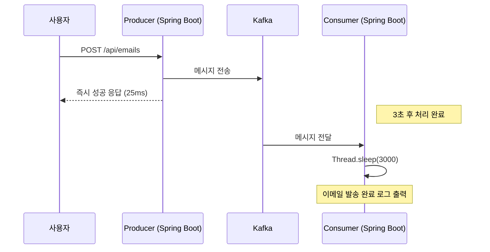

# 05. Spring Boot와 카프카 연동 - 비동기 처리의 이점

## 카프카의 비동기 처리로 인한 성능 이점 느껴보기

REST API 방식은 요청을 보낸 뒤 모든 작업이 처리될 때까지 기다려야 하지만, 카프카를 활용한 비동기 방식은 작업 완료 여부와 상관없이 즉시 응답할 수 있다.

### 1. Consumer 서버 코드 수정 (지연 시간 시뮬레이션)

이메일 발송에 3초가 걸린다고 가정하고 `EmailSendConsumer` 코드를 수정한다.

**EmailSendConsumer.java**
```java
@Service
public class EmailSendConsumer {

    @KafkaListener(topics = "email.send", groupId = "email-send-group")
    public void consume(String message) {
        System.out.println("Kafka로부터 받아온 메시지: " + message);

        // 3초간 지연 발생 (이메일 발송 시뮬레이션)
        try {
            Thread.sleep(3000);
        } catch (InterruptedException e) {
            throw new RuntimeException("이메일 발송 실패");
        }

        System.out.println("이메일 발송 완료");
    }
}
```

### 2. 성능 이점 테스트

1. **API 요청**: Postman이나 `test.http`를 통해 이메일 발송 요청을 보낸다.
2. **응답 속도 확인**: 이메일 발송 자체는 3초가 걸리지만, API 응답은 **25ms 내외**로 즉시 돌아온다.
3. **Consumer 로그 확인**: 응답이 나간 후 약 3초 뒤에 컨슈머 터미널에 "이메일 발송 완료" 로그가 찍히는 것을 확인할 수 있다.



---

## 비동기 처리의 한계와 보완 전략

비동기 처리는 빠른 응답 속도를 제공하지만, **사용자에게 최종 성공 여부를 즉시 알릴 수 없다**는 단점이 있다.

### 1. 한계점
- 사용자는 25ms 만에 성공 응답을 받았으나, 실제 컨슈머에서 이메일 주소 오류 등으로 처리에 실패할 수 있다.
- 이미 응답을 보낸 상태이므로 사용자에게 실패 사실을 즉시 알리기 어렵다.

### 2. 보완 전략
이러한 단점을 보완하기 위해 시스템에서는 다음과 같은 전략을 사용한다.

- **재시도(Retry)**: 메시지 처리 중 일시적인 오류가 발생하면 자동으로 다시 시도한다.
- **Dead Letter Topic(DLT)**: 여러 번의 재시도 끝에도 실패한 메시지를 별도의 토픽에 보관하여 나중에 분석하거나 수동으로 처리한다.

---

다음 단계에서는 실패한 메시지를 **재시도(Retry)**하고 **Dead Letter Topic(DLT)**을 활용하는 구체적인 방법에 대해 학습한다.
