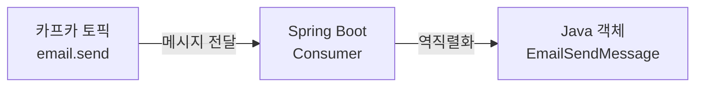

# 05. Spring Boot와 카프카 연동 - 컨슈머

## Spring Boot로 Kafka에서 메시지 조회하기 (Consumer)

카프카 브로커에 저장된 메시지를 실시간으로 가져와서 처리하는 컨슈머 애플리케이션을 구현한다.



### 1. Spring Boot 프로젝트 셋팅

`consumer` 위치에 프로젝트를 구성한다.

- **Artifact / Name**: `consumer`
- **Dependencies**:
    - `Spring Boot DevTools`
    - `Spring Web`
    - `Spring for Apache Kafka`

### 2. application.yml 설정

컨슈머 서버는 프로듀서 서버와 포트가 충돌하지 않도록 랜덤 포트(`0`)를 사용하며, 역직렬화 및 오프셋 초기화 설정을 추가한다.

**application.yml**
```yaml
server:
  port: 0 # 랜덤 포트 사용

spring:
  kafka:
    bootstrap-servers: 15.164.96.71:9092
    consumer:
      # 메시지의 key 역직렬화 방식: 카프카의 바이트 데이터를 String으로 변환한다.
      key-deserializer: org.apache.kafka.common.serialization.StringDeserializer
      # 메시지의 value 역직렬화 방식: 카프카의 바이트 데이터를 String으로 변환한다.
      value-deserializer: org.apache.kafka.common.serialization.StringDeserializer
      
      # 컨슈머 그룹이 없으면 처음부터 메시지를 읽고, 있으면 기존 오프셋 이후부터 읽는다.
      auto-offset-reset: earliest
```

### 3. 메시지 객체 및 컨슈머 서비스 구현

#### EmailSendMessage (메시지 객체)
카프카에서 수신한 JSON 문자열을 Java 객체로 변환(역직렬화)하는 로직을 포함한다.

```java
public class EmailSendMessage {
    private String from;
    private String to;
    private String subject;
    private String body;

    // 역직렬화(String -> Java Object)를 위해 기본 생성자가 반드시 필요하다.
    public EmailSendMessage() {}

    public static EmailSendMessage fromJson(String json) {
        ObjectMapper objectMapper = new ObjectMapper();
        return objectMapper.readValue(json, EmailSendMessage.class);
    }
    // ... getter 생략 ...
}
```

#### EmailSendConsumer (컨슈머 서비스)
`@KafkaListener` 어노테이션을 사용하여 특정 토픽과 컨슈머 그룹을 구독한다.

```java
@Service
public class EmailSendConsumer {

    @KafkaListener(
        topics = "email.send",
        groupId = "email-send-group"
    )
    public void consume(String message) {
        System.out.println("Kafka로부터 받아온 메시지: " + message);
        EmailSendMessage emailSendMessage = EmailSendMessage.fromJson(message);
        // 실제 비즈니스 로직(이메일 발송 등) 처리
        System.out.println("이메일 발송 완료");
    }
}
```

### 4. 테스트 및 확인

1. **컨슈머 서버 실행**: 서버가 구동되자마자 카프카 토픽에 쌓여있던 이전 메시지들을 가져와서 처리한다.
2. **실시간 메시지 처리**: 프로듀서 서버에 API 요청을 보내면, 컨슈머 서버가 즉시 메시지를 수신하여 로그를 출력하는 것을 확인한다.
3. **컨슈머 그룹 정보 확인**: CLI를 통해 `CURRENT-OFFSET`이 증가하는 것을 확인한다.

```bash
$ bin/kafka-consumer-groups.sh \
    --bootstrap-server localhost:9092 \
    --group email-send-group \
    --describe
```
