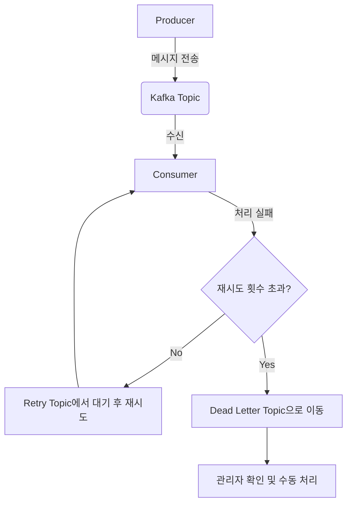

# 05. Spring Boot와 카프카 연동 - Dead Letter Topic (DLT)

## 재시도조차 실패한 메시지를 따로 보관하기 (DLT)

재시도를 여러 번 수행했음에도 불구하고 처리에 최종적으로 실패한 메시지는 어떻게 처리해야 할까? 이런 메시지를 그대로 버리면 데이터 유실이 발생한다. 이때 **Dead Letter Topic(DLT)**을 활용하여 실패한 메시지를 안전하게 보관하고 후속 조치를 취할 수 있다.

### 1. Dead Letter Topic(DLT)이란?

**DLT**는 **오류로 인해 정상적으로 처리할 수 없는 메시지를 임시로 저장하는 전용 토픽**이다.

- **유실 방지**: 최종 실패한 메시지를 버리지 않고 보관한다.
- **원인 분석**: DLT에 쌓인 메시지를 확인하여 시스템의 버그나 데이터 오류를 분석할 수 있다.
- **수동 처리**: 관리자가 DLT의 메시지를 확인한 후 수동으로 재처리하거나 데이터를 수정할 수 있다.

---

### 2. DLT 설정 및 실습

Spring Kafka는 `@RetryableTopic`을 사용하면 자동으로 DLT 설정을 지원한다.

#### EmailSendConsumer.java (설정 추가)

`dltTopicSuffix` 옵션을 사용하여 DLT 토픽의 이름을 명시적으로 지정할 수 있다.

```java
@RetryableTopic(
    attempts = "5",
    backoff = @Backoff(delay = 1000, multiplier = 2),
    dltTopicSuffix = ".dlt" // DLT 토픽 접미사 설정 (기본값: -dlt)
)
@KafkaListener(topics = "email.send", groupId = "email-send-group")
public void consume(String message) {
    // ...
}
```

#### 실습 과정

1. **서버 실행 및 요청**: `to` 필드를 `fail@naver.com`으로 설정하여 API 요청을 보낸다.
2. **재시도 수행**: 로그를 통해 5번의 시도가 모두 실패하는 것을 확인한다.
3. **DLT 전송 확인**: 마지막 시도 실패 후 메시지가 `email.send.dlt` 토픽으로 전송되었다는 로그가 찍힌다.

---

### 3. CLI로 DLT 확인하기

#### 토픽 목록 조회
```bash
$ bin/kafka-topics.sh --bootstrap-server localhost:9092 --list
```
출력 결과에 `email.send.dlt`가 생성되어 있어야 한다.

#### DLT 메시지 내용 확인
```bash
$ bin/kafka-console-consumer.sh \
    --bootstrap-server localhost:9092 \
    --topic email.send.dlt \
    --from-beginning
```
재시도 끝에 실패한 JSON 메시지가 그대로 보관되어 있는 것을 확인할 수 있다.

---

### 4. DLT 활용 흐름도



재시도조차 실패한 메시지를 DLT에 보관함으로써 시스템의 안정성과 데이터 무결성을 확보할 수 있다.
