# 05. Spring Boot와 카프카 연동 - Dead Letter Topic (DLT)

## 재시도조차 실패한 메시지를 따로 보관하기 (DLT)

재시도를 여러 번 수행했음에도 불구하고 처리에 최종적으로 실패한 메시지는 어떻게 처리해야 할까? 이런 메시지를 그대로 버리면 데이터 유실이 발생한다. 이때 **Dead Letter Topic(DLT)**을 활용하여 실패한 메시지를 안전하게 보관하고 후속 조치를 취할 수 있다.

### 1. Dead Letter Topic(DLT)이란?

**DLT**는 **오류로 인해 정상적으로 처리할 수 없는 메시지를 임시로 저장하는 전용 토픽**이다.

- **유실 방지**: 최종 실패한 메시지를 버리지 않고 보관한다.
- **원인 분석**: DLT에 쌓인 메시지를 확인하여 시스템의 버그나 데이터 오류를 분석할 수 있다.
- **수동 처리**: 관리자가 DLT의 메시지를 확인한 후 수동으로 재처리하거나 데이터를 수정할 수 있다.

> **💡 재시도(Retry) 토픽 vs DLT**
> - **재시도 토픽**: 처리에 실패했을 때 "다시 시도하기 위해" 메시지를 잠시 옮겨두는 곳이다. (스프링이 자동으로 관리)
> - **DLT**: 정해진 횟수만큼 재시도했음에도 "결국 실패했을 때" 마지막으로 메시지가 쌓이는 곳이다.

---

### 2. DLT 설정 및 실습

Spring Kafka는 `@RetryableTopic`을 사용하면 자동으로 DLT 설정을 지원한다.

#### EmailSendConsumer.java (설정 추가)

`dltTopicSuffix` 옵션을 사용하여 DLT 토픽의 이름을 명시적으로 지정할 수 있다.

```java
@RetryableTopic(
    attempts = "5",
    backoff = @Backoff(delay = 1000, multiplier = 2),
    dltTopicSuffix = ".dlt" // DLT 토픽 접미사 설정 (기본값: -dlt)
)
@KafkaListener(topics = "email.send", groupId = "email-send-group")
public void consume(String message) {
    // ...
}
```

#### 실습 과정

1. **서버 실행 및 요청**: `to` 필드를 `fail@naver.com`으로 설정하여 API 요청을 보낸다.
2. **재시도 수행**: 로그를 통해 5번의 시도가 모두 실패하는 것을 확인한다.
3. **DLT 전송 확인**: 마지막 시도 실패 후 메시지가 `email.send.dlt` 토픽으로 전송되었다는 로그가 찍힌다.

---

### 3. CLI로 DLT 확인하기

#### 토픽 목록 조회
```bash
$ bin/kafka-topics.sh --bootstrap-server localhost:9092 --list
```
출력 결과에 `email.send.dlt`가 생성되어 있어야 한다.

#### DLT 메시지 내용 확인
```bash
$ bin/kafka-console-consumer.sh \
    --bootstrap-server localhost:9092 \
    --topic email.send.dlt \
    --from-beginning
```
재시도 끝에 실패한 JSON 메시지가 그대로 보관되어 있는 것을 확인할 수 있다.

---

### 4. DLT 활용 흐름도

```mermaid
graph LR
    subgraph MainTopic [메인 토픽: email.send]
        M1[메시지 A]
    end

    subgraph RetrySystem [재시도 시스템]
        R1[Retry Topic 1]
        R2[Retry Topic 2]
        RN[...]
    end

    subgraph DLT [데드 레터 토픽: email.send.dlt]
        D1[실패한 메시지 A]
    end

    Producer[프로듀서] -->|1. 전송| MainTopic
    MainTopic -->|2. 소비 시도| Consumer[컨슈머]
    Consumer -->|3. 처리 실패| RetrySystem
    RetrySystem -->|4. 일정 간격 재시도| Consumer
    Consumer -->|5. 최종 실패| DLT
    DLT -->|6. 사후 분석 및 수동 처리| Admin[관리자]

    style MainTopic fill:#e1f5fe,stroke:#01579b
    style RetrySystem fill:#fff3e0,stroke:#ff6f00,stroke-dasharray: 5 5
    style DLT fill:#ffebee,stroke:#b71c1c
    style D1 fill:#ffcdd2,stroke:#b71c1c
```



재시도조차 실패한 메시지를 DLT에 보관함으로써 시스템의 안정성과 데이터 무결성을 확보할 수 있다.
    
---

### 5. DLT 핸들러 활용 <a name="dlt-handler"></a>

최종 실패한 메시지가 DLT로 넘어올 때, 이를 감지하여 추가적인 비즈니스 로직(관리자 알림, DB 저장 등)을 수행할 수 있다.

#### @DltHandler 사용법

`@RetryableTopic`이 적용된 컨슈머 클래스 내에 `@DltHandler` 어노테이션을 붙인 메서드를 작성한다.

```java
@DltHandler
public void handleDlt(String message, @Header(KafkaHeaders.RECEIVED_TOPIC) String topic) {
    // DLT로 넘어온 메시지를 로그로 남기거나 알림을 보낸다.
    System.out.println("[DLT Handler] " + topic + " 로부터 넘어온 메시지: " + message);
}
```

- **message**: DLT로 전송된 원본 메시지 내용이다.
- **topic**: 메시지가 넘어온 토픽 정보를 확인할 수 있다.
