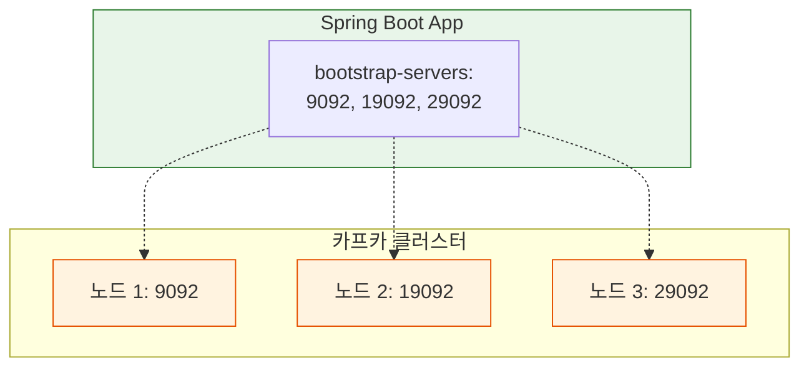

# [실습] Spring Boot에 Kafka 서버 3대 연결하기

고가용성이 확보된 카프카 클러스터(3대의 노드)를 Spring Boot 애플리케이션에 연결하여 사용하는 방법을 학습한다.

---

## ✅ 개요

이전 실습에서 3대의 카프카 노드로 클러스터를 구성하고, 리더 장애 시에도 서비스가 중단되지 않는 것을 확인했다. 실제 애플리케이션(Spring Boot)에서도 여러 대의 카프카 서버 주소를 등록해두어야 일부 서버에 장애가 발생하더라도 안정적으로 카프카를 사용할 수 있다.

---

## ✅ 실습 과정

### 1. Producer(프로듀서) 설정 수정

`producer` 프로젝트의 `application.yml`에서 `bootstrap-servers` 항목을 리스트 형태로 수정한다.

**application.yml**
```yaml
spring:
  kafka:
    # 여러 대의 Kafka 서버 주소를 리스트로 등록한다.
    bootstrap-servers:
      - {Kafka-IP}:9092
      - {Kafka-IP}:19092
      - {Kafka-IP}:29092
    producer:
      key-serializer: org.apache.kafka.common.serialization.StringSerializer
      value-serializer: org.apache.kafka.common.serialization.StringSerializer
```

### 2. Consumer(컨슈머) 설정 수정

`consumer` 프로젝트의 `application.yml`도 동일하게 수정한다.

**application.yml**
```yaml
server:
  port: 0

spring:
  kafka:
    # 컨슈머 역시 모든 브로커 정보를 알고 있어야 안정적인 연결이 가능하다.
    bootstrap-servers:
      - {Kafka-IP}:9092
      - {Kafka-IP}:19092
      - {Kafka-IP}:29092
    consumer:
      key-deserializer: org.apache.kafka.common.serialization.StringDeserializer
      value-deserializer: org.apache.kafka.common.serialization.StringDeserializer
      auto-offset-reset: earliest
```

---

## ✅ 결과 해석

### 왜 여러 대의 주소를 적어주나요?

1. **초기 연결(Bootstrapping)**: 클라이언트는 설정된 주소 중 하나에 접속하여 전체 클러스터의 정보(어떤 브로커가 있고, 누가 리더인지 등)를 가져온다. 만약 서버를 1대만 적어주었는데 그 서버가 다운되어 있다면, 클러스터 전체가 멀쩡하더라도 애플리케이션은 접속에 실패하게 된다.
2. **장애 허용(Fault Tolerance)**: 여러 대의 주소를 적어두면, 그 중 일부 서버가 중단되더라도 살아있는 다른 서버를 통해 클러스터 정보를 받아오고 정상적으로 연결을 유지할 수 있다.

> **참고**: 리스트에 모든 브로커를 다 적을 필요는 없지만, 고가용성을 위해 최소 2~3대 이상의 주소를 포함하는 것이 일반적이다.

---

## 📊 연결 구조 시각화


