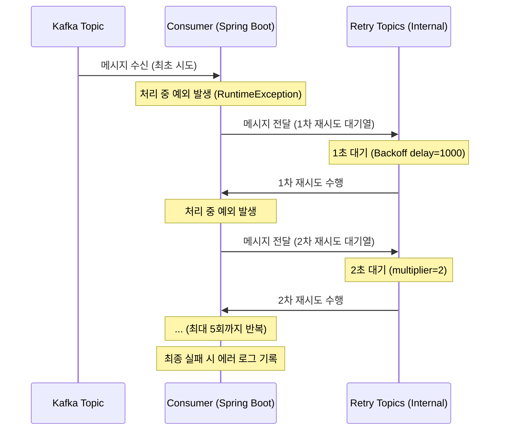

# 05. Spring Boot와 카프카 연동 - 재시도(Retry)

## 처리에 실패한 메시지를 재시도(Retry)하도록 만들기

비동기 처리 구조에서는 사용자에게 이미 성공 응답을 보낸 후 컨슈머에서 작업을 수행한다. 이때 컨슈머에서 실제 작업에 실패하더라도 사용자에게 실패 여부를 다시 전달하기 어렵기 때문에, 시스템 자체적으로 재시도(Retry)를 수행하여 작업을 완수하도록 구성해야 한다.

### 1. 실패 상황 시뮬레이션

의도적으로 실패를 발생시키기 위해 특정 이메일 주소(`fail@naver.com`)인 경우 예외를 던지도록 컨슈머 코드를 수정한다.

**EmailSendConsumer.java**
```java
@Service
public class EmailSendConsumer {

    @KafkaListener(topics = "email.send", groupId = "email-send-group")
    public void consume(String message) {
        System.out.println("Kafka로부터 받아온 메시지: " + message);
        EmailSendMessage emailSendMessage = EmailSendMessage.fromJson(message);

        // 잘못된 이메일 주소일 경우 실패 가정
        if (emailSendMessage.getTo().equals("fail@naver.com")) {
            System.out.println("잘못된 이메일 주소로 인해 발송 실패");
            throw new RuntimeException("잘못된 이메일 주소로 인해 발송 실패");
        }

        // ... 실제 로직 및 지연 시간 생략 ...
        System.out.println("이메일 발송 완료");
    }
}
```

### 2. 기본 재시도 동작 확인

별도의 설정을 하지 않아도 스프링 카프카는 기본적으로 재시도 전략을 가지고 있다.

- **테스트**: `to` 필드에 `fail@naver.com`을 넣어 API 요청을 보낸다.
- **로그 확인**: 서버 로그에서 여러 번 재시도되는 흔적을 확인할 수 있다.
- **기본값 분석**:
    - `interval=0`: 실패 즉시 재시도
    - `maxAttempts=9`: 최대 9번 재시도
    - `currentAttempts=10`: 최초 시도 1회 + 재시도 9회

---

## 재시도(Retry) 정책 변경하기

기본 설정을 변경하여 시스템의 부하를 조절하고 효율적인 장애 대응이 가능하도록 설정할 수 있다.

### 1. @RetryableTopic 적용

`@RetryableTopic` 어노테이션을 사용하여 재시도 횟수와 간격을 세부적으로 설정한다.

**EmailSendConsumer.java**
```java
@RetryableTopic(
    attempts = "5", // 총 시도 횟수 (최초 1회 + 재시도 4회)
    backoff = @Backoff(delay = 1000, multiplier = 2) // 1초부터 시작하여 2배씩 지연 시간 증가
)
@KafkaListener(topics = "email.send", groupId = "email-send-group")
public void consume(String message) {
    // ...
}
```

### 2. 설정의 의미
- **재시도 횟수**: 보통 3~5회로 설정한다. 너무 많으면 시스템 부하가 커지고, 너무 적으면 일시적인 장애에 대응하기 어렵다.
- **지수적 백오프 (Exponential Backoff)**: 재시도 간격을 지수적으로 늘려(1s -> 2s -> 4s -> 8s) 일시적인 장애에는 빠르게 대응하고, 지속적인 장애 시에는 무의미한 재시도를 줄인다.

### 3. 결과 확인
서버를 재실행하고 다시 요청을 보내면, 로그를 통해 설정한 간격(1, 2, 4, 8초)에 따라 정확히 5번까지 시도한 후 에러가 발생하는 것을 확인할 수 있다.

---

## 재시도(Retry) 과정 시각화

재시도 메커니즘이 동작하는 전체적인 흐름을 시퀀스 다이어그램으로 나타내면 다음과 같다.



---

재시도를 여러 번 했음에도 불구하고 최종적으로 실패한 메시지는 어떻게 처리해야 할까? 다음 단계에서는 이러한 메시지를 별도로 보관하는 **Dead Letter Topic(DLT)**에 대해 학습한다.
