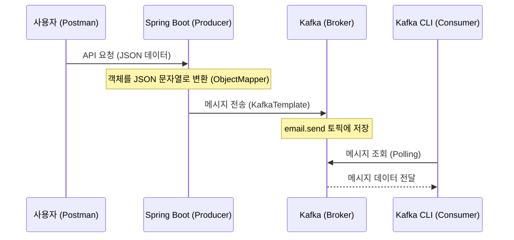

# 05. Spring Boot와 카프카 연동 - 테스트

## Spring Boot가 Kafka에 메시지를 잘 넣는지 테스트하기

구현한 프로듀서가 실제 카프카 브로커로 메시지를 정상적으로 전송하는지 확인한다.

### 1. 깔끔한 테스트를 위한 기존 리소스 삭제

이전 실습에서 생성했던 토픽과 컨슈머 그룹을 삭제하여 깨끗한 상태에서 테스트를 진행한다.

**토픽 삭제 및 재생성:**
```bash
# 1. 전체 토픽 조회
$ bin/kafka-topics.sh --bootstrap-server localhost:9092 --list

# 2. 기존 email.send 토픽 삭제
$ bin/kafka-topics.sh --bootstrap-server localhost:9092 --delete --topic email.send

# 3. 토픽 재생성
$ bin/kafka-topics.sh --bootstrap-server localhost:9092 --create --topic email.send
```

**컨슈머 그룹 삭제:**
```bash
# 1. 전체 컨슈머 그룹 조회
$ bin/kafka-consumer-groups.sh --bootstrap-server localhost:9092 --list

# 2. 기존 email-send-group 삭제
$ bin/kafka-consumer-groups.sh --bootstrap-server localhost:9092 --delete --group email-send-group
```

---

### 2. Spring Boot 서버 실행 및 API 요청

**서버 실행:**
IDE에서 `ProducerApplication`을 실행하거나 터미널에서 아래 명령어를 입력한다.
```bash
$ ./gradlew bootRun
```

**API 요청 (Postman 또는 IntelliJ HTTP Client 활용):**

IntelliJ를 사용 중이라면 프로젝트 루트에 생성된 `test.http` 파일을 활용하여 간편하게 요청을 보낼 수 있다.

- **Method**: `POST`
- **URL**: `http://localhost:8080/api/emails`
- **Body (JSON)**:
```json
{
  "from": "sender@example.com",
  "to": "receiver@example.com",
  "subject": "안녕하세요",
  "body": "카프카 테스트 메시지입니다."
}
```

---

### 3. Kafka 메시지 적재 확인

카프카 CLI 컨슈머를 사용하여 메시지가 토픽에 잘 들어왔는지 확인한다.

```bash
$ bin/kafka-console-consumer.sh \
    --bootstrap-server localhost:9092 \
    --topic email.send \
    --from-beginning
```

**실행 결과:**
```text
{"from":"sender@example.com","to":"receiver@example.com","subject":"안녕하세요","body":"카프카 테스트 메시지입니다."}
```
메시지가 JSON 문자열 형태로 출력된다면 성공이다.

---

### 4. 전체 흐름 정리



1. 사용자가 API를 통해 Spring Boot 서버로 이메일 발송 요청을 보낸다.
2. Spring Boot 서버는 받은 데이터를 `EmailSendMessage` 객체로 만들고, 이를 JSON 문자열로 변환한다.
3. `KafkaTemplate`을 사용하여 카프카의 `email.send` 토픽으로 메시지를 전송한다.
4. 카프카 CLI 컨슈머를 통해 토픽에 데이터가 정상적으로 저장되었는지 실시간으로 확인한다.
