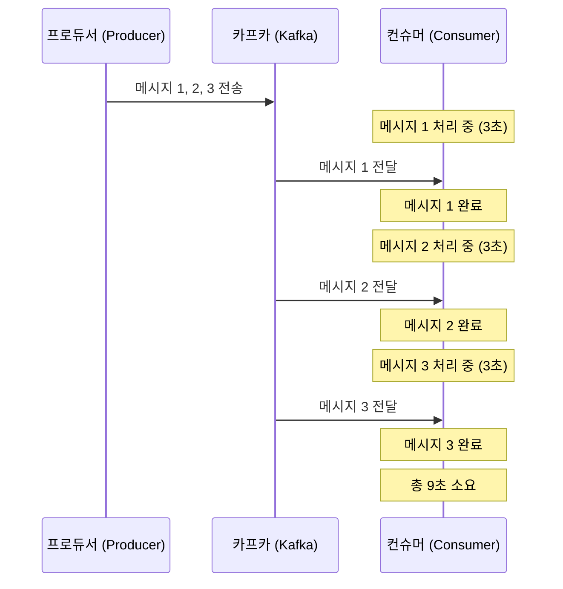

# 06. 상세 동작 및 활용 - 성능 최적화

## 컨슈머가 메시지를 하나씩만 처리하는 현상

### 1. 현상 파악 (실습)
현재 구현된 `consumer`는 멀티 쓰레드 기반의 스프링 부트 애플리케이션임에도 불구하고, 카프카로부터 받은 메시지를 병렬로 처리하지 못하고 하나씩 순차적으로 처리하는 모습을 보인다.

**실습 과정:**
1. 프로듀서와 컨슈머 서버를 실행한다. (컨슈머에는 `Thread.sleep(3000)`이 설정되어 있어야 한다.)
2. API를 통해 3회 연속으로 이메일 발송 요청을 보낸다.
3. 컨슈머 로그를 확인한다.

**로그 분석:**
- 첫 번째 메시지 처리 시작 → 3초 후 완료
- 두 번째 메시지 처리 시작 → 3초 후 완료
- 세 번째 메시지 처리 시작 → 3초 후 완료
- **결과**: 총 3개의 메시지를 처리하는 데 9초가 소요된다.

### 2. 왜 한 번에 하나씩만 처리할까?
스프링 부트 서버는 충분히 병렬 처리가 가능한 구조이지만, 카프카 컨슈머는 기본적으로 할당된 자원을 순차적으로 소비한다.

- **원인**: 이는 카프카의 핵심 개념인 **파티션(Partition)**과 밀접한 관련이 있다.
- **예고**: 다음 단계에서는 파티션이 무엇인지, 그리고 어떻게 파티션을 활용하여 컨슈머의 처리 성능을 높일 수 있는지 학습한다.

---

