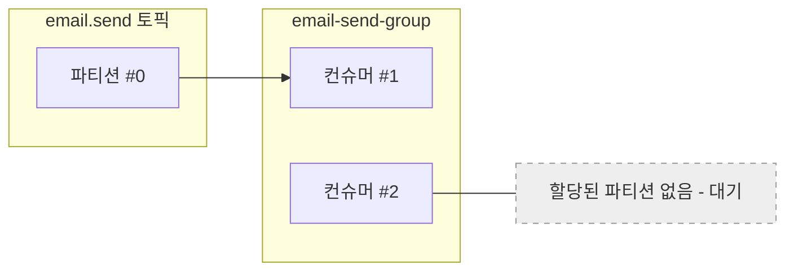

# 06. 상세 동작 및 활용 - 파티션 할당 실습

## 하나의 파티션에는 정말 하나의 컨슈머만 할당될까?

파티션의 중요한 특징 중 하나는 **동일한 컨슈머 그룹 내에서 하나의 파티션은 단 하나의 컨슈머에게만 할당된다**는 것이다. 이번 실습에서는 아래 그림과 같이 하나의 파티션에 정말 하나의 컨슈머만 할당되는지 확인해본다.

---

## [실습] 파티션 할당 확인하기

### 1. Spring Boot 서버 두 대 실행시키기

하나의 프로젝트를 서로 다른 포트에서 두 번 실행하여 멀티 컨슈머 환경을 구성한다.

1. **IntelliJ 실행 설정**: 'Run/Debug Configurations' 페이지로 들어간다.
   

2. **이름 설정**: 기존 실행 환경의 이름을 `ConsumerApplication-1` 등으로 변경하여 구분한다.
   

3. **실행할 서버 환경 추가하기**: 동일한 메인 클래스를 사용하는 새로운 실행 환경(`ConsumerApplication-2`)을 추가한다.
   
   

4. **서버 두 대 실행시키기**: 두 대의 서버를 각각 실행한다. `application.yml`에 `server.port: 0`으로 설정되어 있으므로 포트 충돌 없이 랜덤 포트로 실행된다.
   
   
   

### 2. API 요청 전송 및 로그 확인

프로듀서를 통해 API 요청을 3번 연속으로 보낸다.

**테스트 결과:**
분명 Consumer 서버를 두 대 실행시켰지만, **한 쪽의 컨슈머 서버에만 메시지 처리 로그가 찍힌다.** 다른 한 대의 컨슈머 서버는 아무런 메시지도 받지 못하고 대기 상태를 유지한다.

---

## 결과 분석

이러한 결과가 나타나는 이유는 현재 `email.send` 토픽의 **파티션이 1개**뿐이기 때문이다.

1. **1:1 할당 원칙**: 카프카는 동일한 컨슈머 그룹 내에서 파티션을 컨슈머들에게 공평하게 배분하려 노력한다. 하지만 파티션이 1개라면, 그 파티션은 오직 한 대의 컨슈머에게만 할당될 수 있다.
2. **유휴 컨슈머**: 파티션보다 컨슈머의 수가 더 많으면, 남는 컨슈머는 파티션을 할당받지 못하고 유휴(Idle) 상태가 된다.
3. **결론**: 컨슈머 서버를 아무리 늘려도 **파티션 수가 1개라면 병렬 처리 성능은 향상되지 않는다.**

---

다음 강의에서는 토픽의 파티션을 늘렸을 때 실제로 병렬 처리가 어떻게 일어나는지 확인해본다.
