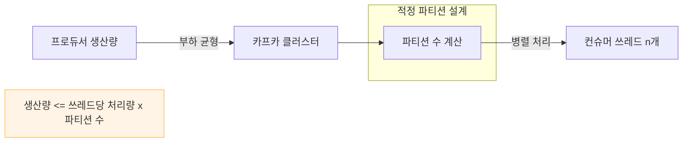

# 06. 상세 동작 및 활용 - 적정 파티션 개수 계산

## 적정 파티션 개수 계산하는 방법

적정 파티션 개수를 정할 때의 핵심은 **‘처리가 지연되는 메시지가 생기지 않는 선에서 파티션을 최소로 설정하는 것’**이다. 너무 적으면 병렬 처리가 부족해 지연이 발생하고, 무작정 많으면 리소스 낭비와 관리 복잡도가 증가하기 때문이다.

공식으로 표현하자면 다음 조건을 만족하도록 파티션 수를 결정해야 한다.

> **프로듀서가 보내는 메시지량 ≤ 하나의 쓰레드가 처리하는 메시지량 × 파티션 수**

---

## 단계별 계산 과정

이해를 돕기 위해 대형 마트의 계산대 운영에 비유할 수 있다. 손님의 대기 줄이 길어지지 않는 선에서 계산대 수를 정해야 하며, 계산대를 너무 많이 열면 인건비 손해가 발생하고 너무 적게 열면 손님의 불만이 터져 나온다.

### 1. 최적의 쓰레드 수 측정
Spring Boot 서버는 멀티 쓰레드 기반으로 동작한다. 부하 테스트를 통해 하나의 서버 인스턴스에서 몇 개의 쓰레드를 사용하는 것이 리소스(CPU, 메모리) 대비 가장 효율적인지 측정해야 한다.

- **가정**: 테스트 결과 한 서버당 100개의 쓰레드를 사용하는 것이 가장 효율적이라고 판단했다.

### 2. 쓰레드당 처리량(Throughput) 산출
설정한 쓰레드 개수를 기반으로 컨슈머 서버가 1초당 처리할 수 있는 전체 메시지량을 측정하고, 이를 쓰레드 수로 나누어 쓰레드당 처리량을 구한다.

- **가정**: 100개의 쓰레드를 사용하는 서버 1대의 1초당 처리량이 30개라고 측정되었다.
- **계산**: 1개의 쓰레드는 1초당 **0.3개**의 요청을 처리한다. ($30 \div 100 = 0.3$)

### 3. 프로듀서의 평균 메시지량 파악
사용자가 보내는 API 요청(메시지 생산량)이 1초당 평균적으로 어느 정도인지 측정하거나 예상한다.

- **가정**: 사용자가 평균적으로 1초당 100개의 요청을 보낸다고 파악했다.

### 4. 적정 파티션 수 결정
지연이 발생하지 않으려면 생산량보다 처리량이 커야 한다. 또한 피크 시간대의 트래픽 초과분(예: 평균의 20% 증분)을 고려하여 여유 있게 설계한다.

- **가정**: 평균 100개에서 여유분을 더해 1초당 **120개**를 처리할 수 있는 환경을 만들고자 한다.
- **공식 대입**:
    - $120 \le 0.3 \times \text{파티션 수}$
    - $\text{파티션 수} = 120 \div 0.3 = \mathbf{400}$

따라서 이 시스템의 적정 파티션 수는 **400개**로 결정할 수 있다.

---

## 요약

1. **쓰레드당 처리 능력**을 먼저 파악한다.
2. **목표 처리량(생산량 + 여유분)**을 정한다.
3. 목표 처리량을 쓰레드당 처리 능력으로 나누어 **필요한 총 파티션 수**를 구한다.

이 과정을 거치면 데이터 유실이나 지연 없이 안정적으로 대규모 트래픽을 처리할 수 있는 카프카 환경을 구축할 수 있다.

