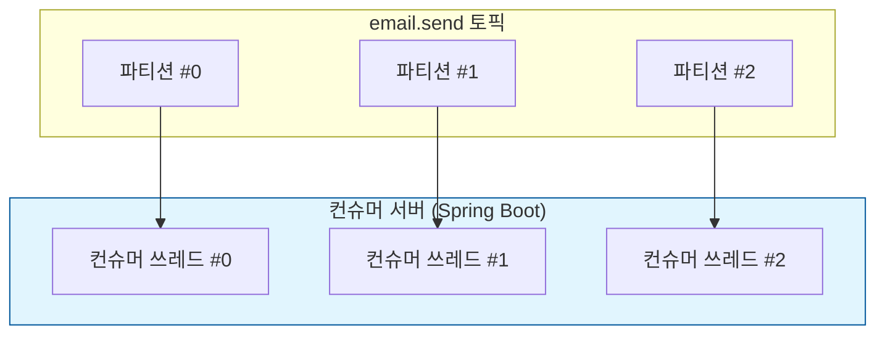

# 06. 상세 동작 및 활용 - 단일 서버 병렬 처리

## 컨슈머 서버 한 대에서 병렬로 메시지 처리하기 (Concurrency)

이전 실습에서는 메시지를 병렬로 처리하기 위해 컨슈머 서버의 대수를 늘렸다. 하지만 서버의 리소스(CPU, 메모리 등)가 충분하다면, 서버 대수를 늘리지 않고도 **하나의 애플리케이션 내에서 여러 개의 컨슈머 쓰레드를 띄워 병렬로 처리**할 수 있다.

---

## [실습] Concurrency 설정을 통한 병렬 처리

### 1. 컨슈머 코드 수정 (Concurrency 설정)

Spring Kafka의 `@KafkaListener` 어노테이션에는 `concurrency`라는 속성이 있다. 이 값을 설정하면 설정한 값만큼의 컨슈머 쓰레드가 생성되어 파티션을 나누어 할당받는다.

**EmailSendConsumer.java**
```java
@Service
public class EmailSendConsumer {

  @KafkaListener(
      topics = "email.send",
      groupId = "email-send-group",
      concurrency = "3" // 3개의 컨슈머 쓰레드를 실행
  )
  public void consume(String message) {
    // ... 기존 로직 ...
  }
}
```

### 2. 서버 실행 및 로그 확인

컨슈머 서버를 한 대만 실행한 뒤 로그를 확인한다.

**로그 확인:**
```text
... : [email-send-group-0-C-1] Subscribed to partition(s): [email.send-0]
... : [email-send-group-1-C-1] Subscribed to partition(s): [email.send-1]
... : [email-send-group-2-C-1] Subscribed to partition(s): [email.send-2]
```
하나의 서버 안에서 3개의 컨슈머 쓰레드(`-0-C-1`, `-1-C-1`, `-2-C-1`)가 생성되어 각각의 파티션을 나누어 할당받은 것을 확인할 수 있다.

### 3. API 요청 전송 및 결과 확인

API 요청을 3번 연속으로 보낸다.

**실행 결과:**
```text
# 거의 동시에 로그가 찍힘
[Partition:0] 이메일 발송 완료 (3초 경과)
[Partition:1] 이메일 발송 완료 (3초 경과)
[Partition:2] 이메일 발송 완료 (3초 경과)
```
서버는 한 대뿐이지만, 내부 쓰레드가 병렬로 작업을 수행하여 3개의 메시지를 처리하는 데 약 **3초**밖에 걸리지 않는다. (순차 처리 시 9초 소요)

---

## 주의사항

1. **파티션 수와의 관계**: `concurrency` 설정값은 해당 토픽의 파티션 수보다 클 필요가 없다. 하나의 파티션은 하나의 컨슈머(쓰레드)에만 할당되기 때문에, 파티션이 3개인데 `concurrency`를 5로 설정하면 2개의 쓰레드는 놀게 된다.
2. **리소스 관리**: 쓰레드를 무작정 늘리면 CPU 및 메모리 사용량이 급증할 수 있으므로, 서버의 사양에 맞춰 적절한 값을 설정해야 한다.

---

## 요약

- **Concurrency** 설정을 통해 단일 컨슈머 서버 내에서 병렬 처리가 가능하다.
- 서버 대수를 늘리는 '스케일 아웃(Scale-out)' 방식과 서버 내부 리소스를 효율적으로 사용하는 '동시성 설정' 방식을 적절히 혼합하여 최적의 성능을 낼 수 있다.


