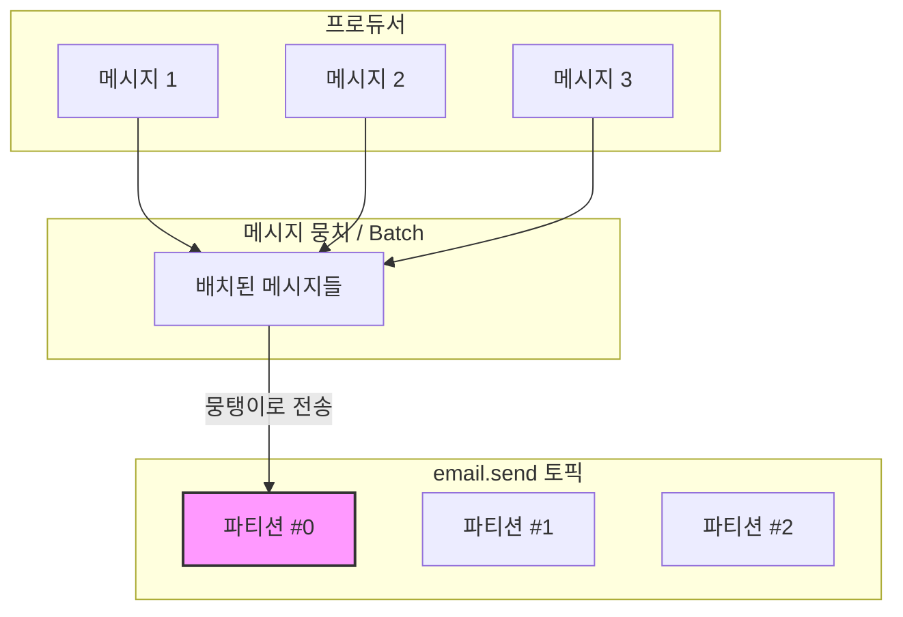
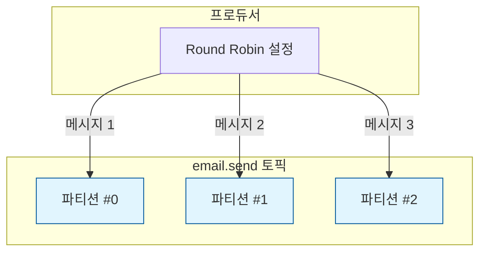

# 06. 상세 동작 및 활용 - 파티션 메시지 분배

## 여러 개의 파티션에 메시지가 골고루 들어가는지 확인해보기

특정 토픽에 메시지를 넣으면 여러 파티션에 메시지가 적절하게 분산된다. 이때 메시지의 형태와 설정에 따라 파티션에 분배되는 방식이 달라진다.

### 1. Key가 포함되지 않은 메시지를 넣을 경우

Key가 없는 메시지는 기본적으로 **스티키 파티셔닝(Sticky Partitioning)** 방식으로 분배된다.

- **스티키 파티셔닝**: 배치 단위로 메시지를 처리하기 위해, 하나의 파티션에 메시지가 일정량 채워질 때까지 해당 파티션에만 메시지를 저장하고, 그 다음에 다음 파티션으로 넘어가는 방식이다.
- **배경**: Kafka 2.4 버전 이전에는 라운드 로빈(Round Robin) 방식이 기본이었으나, 대규모 데이터 처리 시 효율성을 높이기 위해 스티키 파티셔닝으로 변경되었다.

**스티키 파티셔닝 동작 흐름:**



### 2. Key가 포함된 메시지를 넣을 경우

Key의 해시(Hash) 값을 기반으로 파티션을 결정한다.
- 같은 Key 값을 가진 메시지는 항상 같은 파티션에 들어가는 것이 보장된다.
- 실습에서는 Key가 포함되지 않은 메시지를 중심으로 확인한다.

---

## [실습] 파티션 분배 방식 확인

### 1. 사전 준비
깨끗한 테스트를 위해 기존 토픽을 삭제하고 파티션 3개로 다시 생성한다.

```bash
# 기존 토픽 삭제
$ bin/kafka-topics.sh --bootstrap-server localhost:9092 --delete --topic email.send

# 파티션 3개인 토픽 생성
$ bin/kafka-topics.sh \
    --bootstrap-server localhost:9092 \
    --create \
    --topic email.send \
    --partitions 3
```

### 2. 실시간 모니터링 설정
메시지가 어느 파티션에 들어가는지 확인하기 위해 `--property print.partition=true` 옵션을 사용하여 컨슈머를 실행한다.

```bash
$ bin/kafka-console-consumer.sh \
    --bootstrap-server localhost:9092 \
    --topic email.send \
    --from-beginning \
    --property print.partition=true
```

### 3. 스티키 파티셔닝 확인
Producer 서버를 실행하고 API 요청을 여러 번 보낸다.

**실행 결과:**
```text
# 작은 규모의 데이터를 연속해서 보낼 경우, 하나의 파티션에만 메시지가 들어간다.
Partition:2	{"from":"sender@example.com","to":"recipient@example.com","subject":"안녕하세요, 카프카 테스트입니다.","body":"Spring Boot에서 카프카로 메시지가 잘 전달되는지 확인합니다."}
Partition:2	{"from":"sender@example.com","to":"recipient@example.com","subject":"안녕하세요, 카프카 테스트입니다.","body":"Spring Boot에서 카프카로 메시지가 잘 전달되는지 확인합니다."}
Partition:2	{"from":"sender@example.com","to":"recipient@example.com","subject":"안녕하세요, 카프카 테스트입니다.","body":"Spring Boot에서 카프카로 메시지가 잘 전달되는지 확인합니다."}
Partition:2	{"from":"sender@example.com","to":"recipient@example.com","subject":"안녕하세요, 카프카 테스트입니다.","body":"Spring Boot에서 카프카로 메시지가 잘 전달되는지 확인합니다."}
Partition:2	{"from":"sender@example.com","to":"recipient@example.com","subject":"안녕하세요, 카프카 테스트입니다.","body":"Spring Boot에서 카프카로 메시지가 잘 전달되는지 확인합니다."}
Partition:2	{"from":"sender@example.com","to":"recipient@example.com","subject":"안녕하세요, 카프카 테스트입니다.","body":"Spring Boot에서 카프카로 메시지가 잘 전달되는지 확인합니다."}
```
작은 규모의 데이터를 연속해서 보낼 경우, 스티키 파티셔닝에 의해 하나의 파티션에만 메시지가 몰리는 것을 확인할 수 있다.

---

## 라운드 로빈(Round Robin) 방식으로 변경하기

작은 데이터라도 여러 파티션에 골고루 나누어 저장하고 싶다면, Producer 설정을 **라운드 로빈** 방식으로 변경할 수 있다.

### 1. application.yml 수정

`producer` 프로젝트의 설정을 다음과 같이 수정한다.

**application.yml:**
```yaml
spring:
  kafka:
    producer:
      properties:
        partitioner.class: org.apache.kafka.clients.producer.RoundRobinPartitioner
```

### 2. 결과 확인
Producer 서버를 재실행하고 다시 API 요청을 보낸다.

**실행 결과:**
```text
Partition:0	{"from":"sender@example.com","to":"recipient@example.com","subject":"안녕하세요, 카프카 테스트입니다.","body":"Spring Boot에서 카프카로 메시지가 잘 전달되는지 확인합니다."}
Partition:1	{"from":"sender@example.com","to":"recipient@example.com","subject":"안녕하세요, 카프카 테스트입니다.","body":"Spring Boot에서 카프카로 메시지가 잘 전달되는지 확인합니다."}
Partition:2	{"from":"sender@example.com","to":"recipient@example.com","subject":"안녕하세요, 카프카 테스트입니다.","body":"Spring Boot에서 카프카로 메시지가 잘 전달되는지 확인합니다."}
Partition:0	{"from":"sender@example.com","to":"recipient@example.com","subject":"안녕하세요, 카프카 테스트입니다.","body":"Spring Boot에서 카프카로 메시지가 잘 전달되는지 확인합니다."}
Partition:1	{"from":"sender@example.com","to":"recipient@example.com","subject":"안녕하세요, 카프카 테스트입니다.","body":"Spring Boot에서 카프카로 메시지가 잘 전달되는지 확인합니다."}
Partition:2	{"from":"sender@example.com","to":"recipient@example.com","subject":"안녕하세요, 카프카 테스트입니다.","body":"Spring Boot에서 카프카로 메시지가 잘 전달되는지 확인합니다."}
```
메시지가 각 파티션에 번갈아가며 골고루 쌓이는 것을 확인할 수 있다.

---

## 요약

### 라운드 로빈(Round Robin) 동작 흐름



라운드 로빈 방식을 사용하면 파티션 수에 맞춰 메시지가 순차적으로 분배되어, 모든 파티션을 골고루 활용할 수 있게 된다.

---

다음 강의에서는 여러 파티션에 분산된 메시지를 어떻게 병렬적으로 처리하는지 알아본다.
