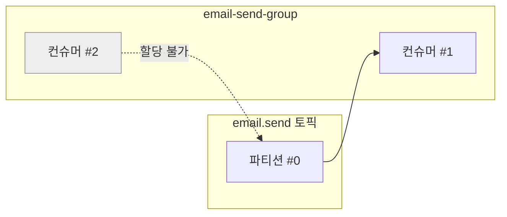
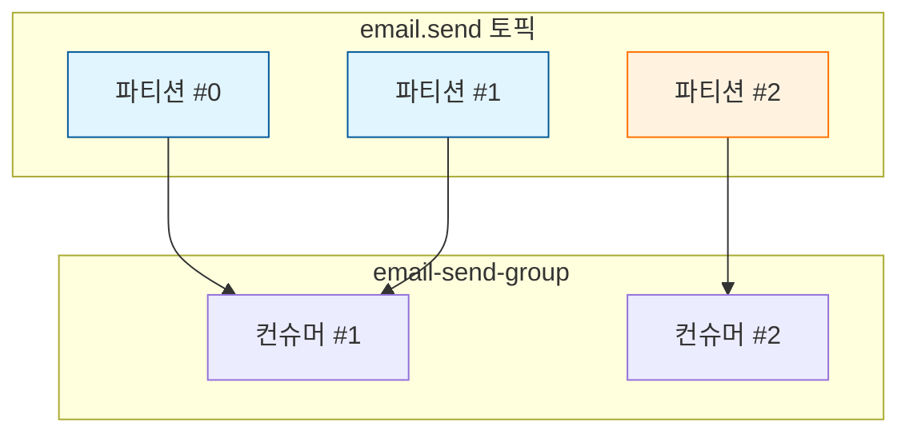

# 06. 상세 동작 및 활용 - 병렬 처리 실습

## Spring Boot에서 여러 개의 컨슈머로 메시지 병렬적으로 처리하기

파티션을 늘린 토픽을 대상으로 여러 대의 컨슈머 서버를 운영하면, 메시지를 병렬적으로 처리하여 전체적인 시스템 성능을 대폭 향상시킬 수 있다.

---

## [실습 1] 단일 컨슈머의 처리 한계 확인

### 1. 환경 설정
- **토픽**: `email.send` (파티션 3개)
- **컨슈머**: `ConsumerApplication` 1대 실행

### 2. 로그 확인
컨슈머 서버 1대만 실행 중일 때는 해당 컨슈머가 토픽의 모든 파티션(0, 1, 2)을 할당받아 처리한다.

```text
# 컨슈머 로그 예시
... : Subscribed to partition(s): [email.send-0, email.send-1, email.send-2]
```

### 3. 처리 속도 테스트
API 요청을 연속으로 3번 보낸다. 컨슈머는 파티션 3개를 모두 담당하고 있지만, 내부적으로는 **한 번에 하나의 작업만 순차적으로 처리**한다.

**실행 결과:**
```text
# 3초 간격으로 로그가 찍힘
[Partition:0] 이메일 발송 완료 (3초 경과)
[Partition:1] 이메일 발송 완료 (6초 경과)
[Partition:2] 이메일 발송 완료 (9초 경과)
```
컨슈머 서버 자체는 멀티 쓰레드 구조여도, 하나의 컨슈머 객체는 할당된 파티션들의 메시지를 하나씩 처리하므로 병렬 처리의 이점을 누리지 못한다.

---

## [실습 2] 멀티 컨슈머를 통한 병렬 처리

### 1. 컨슈머 추가 실행
동일한 컨슈머 그룹(`email-send-group`)을 사용하는 컨슈머 서버를 한 대 더 실행한다. (`ConsumerApplication-2`)

### 2. 파티션 자동 재분배 (Rebalancing) 확인
두 번째 컨슈머가 실행되면 카프카는 파티션을 다시 배분한다.

**로그 확인:**
- **Consumer-1**: 파티션 0, 1 담당
- **Consumer-2**: 파티션 2 담당

```text
# Consumer-1 로그
... : Subscribed to partition(s): [email.send-0, email.send-1]

# Consumer-2 로그
... : Subscribed to partition(s): [email.send-2]
```

### 3. 병렬 처리 결과 확인
API 요청을 다시 3번 연속으로 보낸다.

**실행 결과:**
```text
# Consumer-1 로그
[Partition:0] 이메일 발송 완료 (3초)
[Partition:1] 이메일 발송 완료 (6초)

# Consumer-2 로그
[Partition:2] 이메일 발송 완료 (3초)
```
두 대의 서버가 파티션을 나누어 동시에 작업을 수행하므로, 전체 처리 시간이 9초에서 **6초**로 단축된다. (파티션 수와 컨슈머 수가 늘어날수록 성능은 더 향상된다.)

---

## 그림으로 이해하기

### 1. 파티션이 부족할 때 (병렬 처리 불가)
파티션이 1개면 컨슈머가 아무리 많아도 병렬 처리가 불가능하다.



### 2. 파티션 증설 후 (병렬 처리 가능)
파티션을 늘리면 각 컨슈머가 독립된 파티션을 담당하여 동시에 메시지를 처리할 수 있다.



## 요약
- **파티션**은 카프카에서 병렬 처리를 가능하게 하는 기본 단위다.
- 계산대(파티션)가 많을수록 더 많은 손님(메시지)을 동시에 처리할 수 있다.
- 컨슈머 리소스가 충분하다면 서버를 늘리는 대신 **하나의 서버 내에서 병렬로 처리하는 방법**도 존재한다. (다음 강의 예고)
