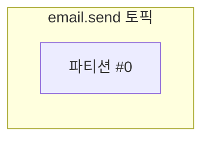
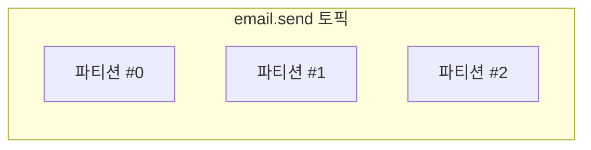
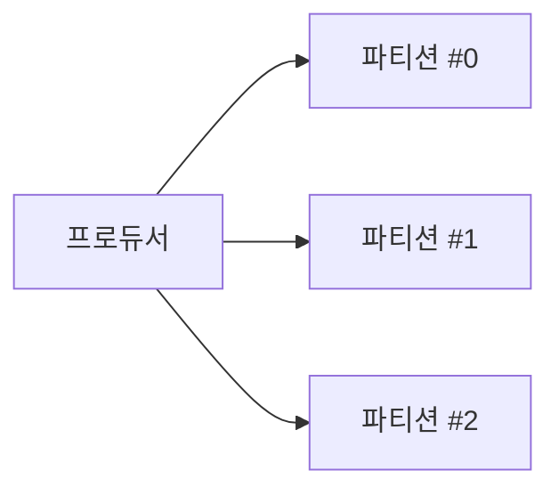
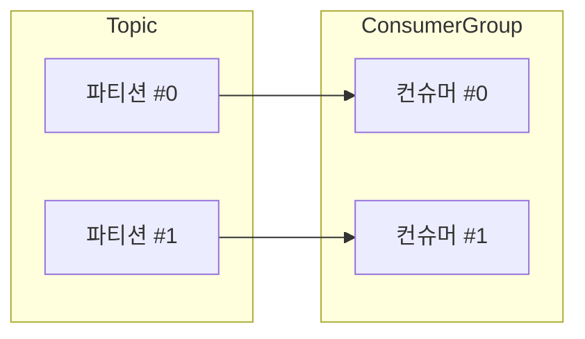
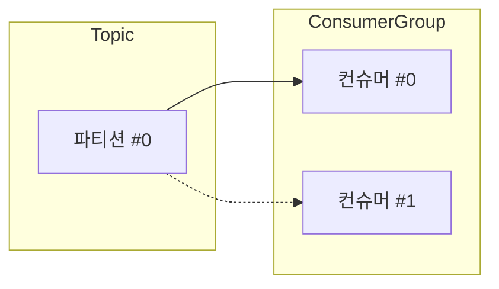
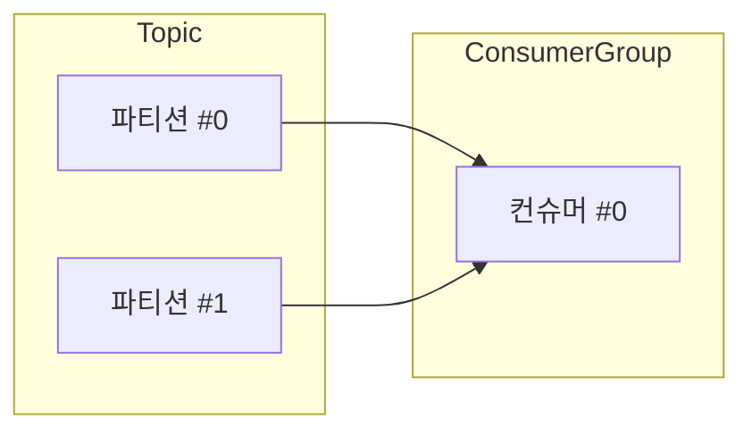

# 06. 상세 동작 및 활용 - 파티션

## 파티션(Partition)이란?

**파티션(Partition)**은 **큐(메시지를 임시로 저장할 수 있는 공간)를 여러 개로 늘려서 병렬 처리를 가능하게 하는 기본 단위**다. 파티션은 메시지 처리량에 큰 영향을 미치는 핵심 요인이다. 메시지를 순차적으로 처리하는 것보다 병렬적으로 처리하는 것이 훨씬 빠르기 때문이다.

---

## 파티션(Partition)의 특징

### 1. 각 토픽은 하나 이상의 파티션으로 구성할 수 있다.
토픽을 생성할 때 별도의 옵션을 주지 않으면 파티션을 1개만 생성한다. 지금까지의 실습에서 생성했던 토픽은 전부 파티션이 1개였다.

하지만 토픽을 생성할 때 파티션을 여러 개 만들 수도 있다.

### 2. 프로듀서가 메시지를 넣으면 여러 파티션에 분산된다.
파티션을 늘리면 메시지를 넣을 수 있는 계산대가 여러 개 생기는 것과 같다. 파티션이 여러 개인 토픽에 메시지를 넣으면, 여러 파티션에 메시지가 적절하게 분산되어 저장된다.

### 3. 하나의 파티션은 하나의 컨슈머에게만 할당된다.
동일한 컨슈머 그룹(Consumer Group) 내에서 하나의 파티션은 단 하나의 컨슈머에게만 할당된다. 여러 컨슈머가 하나의 파티션을 동시에 처리할 수는 없다.

**정상적인 구조:**

**잘못된 구조 (불가능):**

### 4. 하나의 컨슈머가 여러 파티션을 처리할 수 있다.
여러 컨슈머가 하나의 파티션을 처리할 수는 없지만, 반대로 하나의 컨슈머가 여러 개의 파티션을 할당받아 처리하는 것은 가능하다.

### 5. 파티션 내의 메시지는 순서대로 처리된다.
하나의 파티션에 할당된 컨슈머는 해당 파티션 내의 메시지를 오프셋 순서대로 처리한다. 즉, 파티션 단위로 메시지 처리 순서가 보장된다.

이 특징 때문에 이전 실습에서 컨슈머가 이메일 발송 작업을 한 번에 하나씩만 처리했던 것이다. 파티션이 1개뿐이었기 때문에, 아무리 컨슈머 서버가 멀티 쓰레드 구조여도 카프카 입장에서는 하나의 파티션 데이터를 순차적으로 보낼 수밖에 없다.

---

다음 강의에서는 실습을 통해 파티션을 늘렸을 때 실제로 병렬 처리가 어떻게 일어나는지 눈으로 확인해본다.
