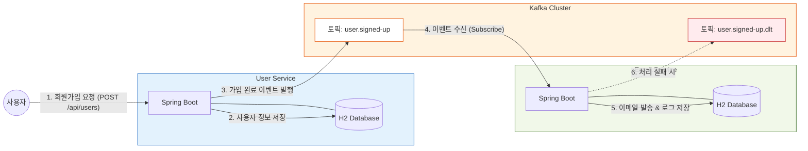

# 07. MSA 프로젝트 실습 - 프로젝트 설계

강의 초반에 언급했듯이, Kafka는 MSA(Microservice Architecture) 구조에서 서비스 간의 결합도를 낮추고 비동기 통신을 처리하기 위해 널리 사용된다. 실제 MSA 환경과 유사한 간단한 프로젝트를 설계하고 구축해본다.

---

## ✅ 구현할 기능

**"회원 가입을 하면 회원가입 축하 이메일을 자동으로 발송하는 시스템"**

### 1. 회원 가입 기능 (User Service)
- 사용자의 가입 정보를 입력받아 DB에 저장한다.
- 가입이 완료되면 이메일 발송을 위한 이벤트를 Kafka로 발행한다.

### 2. 이메일 발송 기능 (Email Service)
- Kafka에서 회원가입 이벤트를 구독(Consume)한다.
- 수신한 정보를 바탕으로 이메일을 발송하고, 발송 기록을 DB에 저장한다.

---

## ✅ 프로젝트 아키텍처

### 주요 설계 특징
- **서비스 분리**: 사용자 관리와 이메일 발송이라는 서로 다른 도메인을 독립적인 서버로 구성한다.
- **데이터베이스 분리**: 각 서비스는 자신만의 DB(H2)를 소유하며, 다른 서비스의 DB에 직접 접근하지 않는다.
- **느슨한 결합(Loose Coupling)**: User Service는 Email Service가 살아있는지, 처리에 성공했는지 알 필요가 없다. 오직 Kafka에 메시지를 전달하는 역할만 수행한다.

---

## ✅ 참고 사항

- 이 실습은 MSA 자체의 복잡한 기법(Service Discovery, API Gateway 등)보다는 **Kafka를 활용한 서비스 간 통신**에 집중한다.
- MSA에 대한 깊은 지식이 없더라도 Kafka의 프로듀서와 컨슈머 개념을 이해하고 있다면 충분히 따라올 수 있도록 구성했다.

---

## ➡️ 다음 단계
- [[실습] User Service 서버 초기 환경 설정](./User-Service-Setup.md)
- [[실습] Email Service 서버 초기 환경 설정](./Email-Service-Setup.md)
