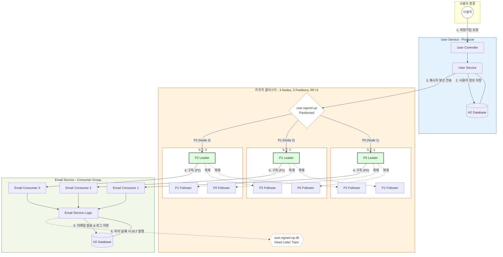

# 07. MSA 프로젝트 실습 - 프로젝트 설계

강의 초반에 언급했듯이, Kafka는 MSA(Microservice Architecture) 구조에서 서비스 간의 결합도를 낮추고 비동기 통신을 처리하기 위해 널리 사용된다. 실제 MSA 환경과 유사한 간단한 프로젝트를 설계하고 구축해본다.

---

## ✅ 구현할 기능

**"회원 가입을 하면 회원가입 축하 이메일을 자동으로 발송하는 시스템"**

### 1. 회원 가입 기능 (User Service)
- 사용자의 가입 정보를 입력받아 DB에 저장한다.
- 가입이 완료되면 이메일 발송을 위한 이벤트를 Kafka로 발행한다.

### 2. 이메일 발송 기능 (Email Service)
- Kafka에서 회원가입 이벤트를 구독(Consume)한다.
- 수신한 정보를 바탕으로 이메일을 발송하고, 발송 기록을 DB에 저장한다.

---

## ✅ 프로젝트 아키텍처

### ✅ 상세 동작 메커니즘
1. **파티션 분산 처리 (Partitioning)**:
   - 토픽 `user.signed-up`은 3개의 파티션으로 나뉘어 있으며, 각 파티션의 **리더**가 서로 다른 노드(1, 2, 3)에 골고루 분산되어 부하를 분산한다.
   - **중요**: 파티션과 노드는 1:1로 매핑되는 것이 아닙니다. 하나의 노드는 여러 파티션(리더 또는 팔로워)을 호스팅할 수 있습니다. 예를 들어 노드 1은 P0의 리더이면서 P1, P2의 팔로워 파티션을 모두 가집니다.
   - User Service(Producer)는 라운드 로빈 방식을 통해 P0, P1, P2 리더들에게 메시지를 순차적으로 전송한다.

2. **리더와 팔로워의 역할 (Leader/Follower)**:
   - **리더 (Leader)**: 그림의 연한 녹색 노드들로, 실제 메시지 생산(Write)과 소비(Read)가 일어나는 핵심 주체다.
   - **팔로워 (Follower)**: 리더 노드의 데이터를 실시간으로 복제하여 저장하며, 장애 발생 시 리더 자리를 이어받을 준비를 한다.

3. **컨슈머 그룹의 병렬 처리 (Parallel Processing)**:
   - Email Service는 3개의 컨슈머가 하나의 그룹으로 묶여 각 파티션의 리더로부터 메시지를 나누어 읽는다.
   - 이를 통해 대량의 회원가입 이벤트를 지연 없이 빠르게 처리할 수 있다.

4. **트래픽 급증 시의 완충 작용 (Buffering & Decoupling)**:
   - **상황**: 이벤트 기간이나 마케팅 알림 등으로 인해 회원가입 요청이 갑자기 10배 이상 폭주하는 상황을 가정해보자.
   - **기존 방식 (REST API)**: User Service가 Email Service의 응답을 기다려야 하므로, Email Service가 느려지면 User Service까지 줄줄이 마비된다.
   - **Kafka 방식**: User Service는 메시지를 카프카에 던지기만 하면 끝난다. Email Service가 아무리 느려져도 User Service의 회원가입 기능은 영향을 받지 않고 빠르게 응답할 수 있다.
   - **결과**: 이때 발생하는 것이 **컨슈머 랙(Consumer Lag)**이다. 카프카가 거대한 담수지 역할을 하여 메시지를 안전하게 보관해주고, Email Service는 자신이 처리할 수 있는 속도로 메시지를 차근차근 가져와서 처리한다. 서비스 전체가 다운되는 '연쇄 장애'를 막아주는 핵심 메커니즘이다.

---

## ✅ 참고 사항

- 이 실습은 MSA 자체의 복잡한 기법(Service Discovery, API Gateway 등)보다는 **Kafka를 활용한 서비스 간 통신**에 집중한다.
- MSA에 대한 깊은 지식이 없더라도 Kafka의 프로듀서와 컨슈머 개념을 이해하고 있다면 충분히 따라올 수 있도록 구성했다.

---

## ➡️ 다음 단계
- [[실습] User Service 서버 초기 환경 설정](./User-Service-Setup.md)
- [[실습] Email Service 서버 초기 환경 설정](./Email-Service-Setup.md)
