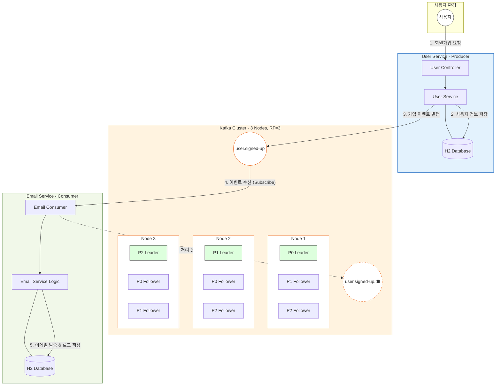

# 07. MSA 프로젝트 실습 - 프로젝트 설계

강의 초반에 언급했듯이, Kafka는 MSA(Microservice Architecture) 구조에서 서비스 간의 결합도를 낮추고 비동기 통신을 처리하기 위해 널리 사용된다. 실제 MSA 환경과 유사한 간단한 프로젝트를 설계하고 구축해본다.

---

## ✅ 구현할 기능

**"회원 가입을 하면 회원가입 축하 이메일을 자동으로 발송하는 시스템"**

### 1. 회원 가입 기능 (User Service)
- 사용자의 가입 정보를 입력받아 DB에 저장한다.
- 가입이 완료되면 이메일 발송을 위한 이벤트를 Kafka로 발행한다.

### 2. 이메일 발송 기능 (Email Service)
- Kafka에서 회원가입 이벤트를 구독(Consume)한다.
- 수신한 정보를 바탕으로 이메일을 발송하고, 발송 기록을 DB에 저장한다.

---

## ✅ 프로젝트 아키텍처

### 주요 설계 특징
- **서비스 분리 (Microservices)**: 사용자 관리(User)와 이메일 발송(Email) 도메인을 독립적인 서버로 구성하여 각각의 책임이 명확하다.
- **데이터베이스 분리 (Database per Service)**: 각 서비스는 자신만의 독립적인 DB(H2)를 소유하며, 데이터 오염이나 강한 결합을 방지한다.
- **이벤트 기반 비동기 통신 (Event-Driven)**: User Service는 가입 사실을 Kafka에 던지기만 할 뿐, Email Service의 상태나 결과에 영향을 받지 않아 성능과 가용성이 높다.
- **고가용성 및 안정성**: 3대의 브로커와 레플리케이션(RF=3) 설정을 통해 서버 장애 시에도 데이터를 보호하며, DLT를 통해 실패한 메시지에 대한 사후 처리가 가능하다.

---

## ✅ 참고 사항

- 이 실습은 MSA 자체의 복잡한 기법(Service Discovery, API Gateway 등)보다는 **Kafka를 활용한 서비스 간 통신**에 집중한다.
- MSA에 대한 깊은 지식이 없더라도 Kafka의 프로듀서와 컨슈머 개념을 이해하고 있다면 충분히 따라올 수 있도록 구성했다.

---

## ➡️ 다음 단계
- [[실습] User Service 서버 초기 환경 설정](./User-Service-Setup.md)
- [[실습] Email Service 서버 초기 환경 설정](./Email-Service-Setup.md)
